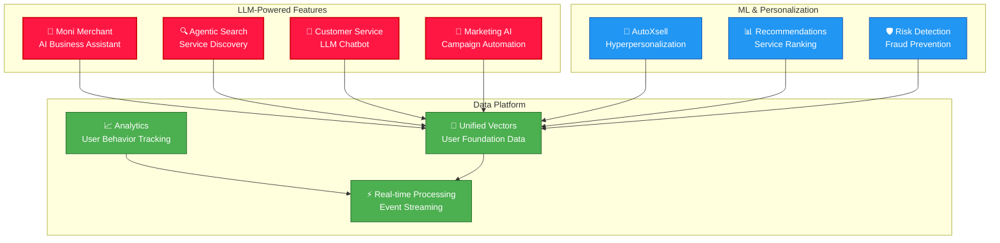
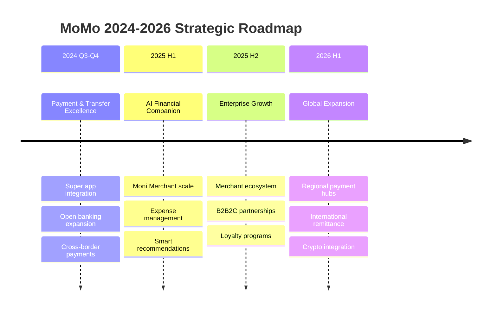

# MoMo Product Engineering

**MoMo - Your Financial Assistant with AI**

A comprehensive product documentation repository for MoMo, Vietnam's leading fintech super app, serving 30M+ monthly active users. This repository is designed for Product Managers, Product Owners, and UX/UI Designers to understand MoMo's complete product ecosystem, strategy, and roadmap.

---

## 📊 Product Overview

```mermaid
graph TB
    subgraph "MoMo - Trợ Thủ Tài Chính Với AI"
        A["🎯 Core Mission<br/>Help users do more with money<br/>through AI-powered financial assistance"]
    end

    subgraph "Payment & Transfer"
        P1["💳 Wallet & Payment<br/>- E-wallet<br/>- QR Payment<br/>- Fund Transfer"]
        P2["⏰ PayLater<br/>- Instant Credit<br/>- Shopping Credit<br/>- Bill Payment"]
        P3["🏧 Cash Flow<br/>- Cash-in/out<br/>- Bank Link<br/>- Open Banking"]
    end

    subgraph "Financial Services"
        F1["💰 Investment<br/>- Funds<br/>- Stocks<br/>- Bonds"]
        F2["🛡️ Insurance<br/>- Auto Insurance<br/>- Health Insurance<br/>- Property Ins."]
        F3["💸 Lending<br/>- Quick Loans<br/>- CreditTech<br/>- Merchant Loans"]
    end

    subgraph "Lifestyle & Utilities"
        L1["🎬 Entertainment<br/>- Movie Tickets<br/>- Games<br/>- Apps"]
        L2["🚗 Travel & Transport<br/>- Bus Tickets<br/>- Flight Booking<br/>- Ride Sharing"]
        L3["📱 Utilities<br/>- Phone Recharge<br/>- Data 4G/5G<br/>- Bill Payment"]
    end

    subgraph "Business Solutions"
        B1["🏪 Merchant Tools<br/>- Soundbox<br/>- QR Payment<br/>- EDC/Card"]
        B2["🤖 Moni Merchant<br/>- Business AI Assistant<br/>- Revenue Tracking<br/>- Compliance Support"]
        B3["📊 Business Analytics<br/>- Dashboard<br/>- Reports<br/>- Insights"]
    end

    subgraph "Growth & Discovery"
        G1["🔍 Discovery Platform<br/>- Homescreen<br/>- Search<br/>- Recommendations"]
        G2["🎁 Loyalty & Rewards<br/>- MoMo Xu Points<br/>- Promotions<br/>- Rewards"]
        G3["🤝 Growth Loops<br/>- Referral<br/>- Cross-sell<br/>- Retention"]
    end

    A --> P1
    A --> P2
    A --> P3
    A --> F1
    A --> F2
    A --> F3
    A --> L1
    A --> L2
    A --> L3
    A --> B1
    A --> B2
    A --> B3
    A --> G1
    A --> G2
    A --> G3

    style A fill:#FF1744,color:#fff,stroke:#C00,stroke-width:3px
    style P1 fill:#00BCD4,color:#000,stroke:#0097A7
    style P2 fill:#00BCD4,color:#000,stroke:#0097A7
    style P3 fill:#00BCD4,color:#000,stroke:#0097A7
    style F1 fill:#FF9800,color:#fff,stroke:#E65100
    style F2 fill:#FF9800,color:#fff,stroke:#E65100
    style F3 fill:#FF9800,color:#fff,stroke:#E65100
    style L1 fill:#4CAF50,color:#fff,stroke:#2E7D32
    style L2 fill:#4CAF50,color:#fff,stroke:#2E7D32
    style L3 fill:#4CAF50,color:#fff,stroke:#2E7D32
    style B1 fill:#9C27B0,color:#fff,stroke:#6A1B9A
    style B2 fill:#9C27B0,color:#fff,stroke:#6A1B9A
    style B3 fill:#9C27B0,color:#fff,stroke:#6A1B9A
    style G1 fill:#FFC107,color:#000,stroke:#FFA000
    style G2 fill:#FFC107,color:#000,stroke:#FFA000
    style G3 fill:#FFC107,color:#000,stroke:#FFA000
```



---

## 🎯 Strategic Product Domains

### 1️⃣ **Payment & Transfer Services**
- **E-Wallet**: Digital payment storage and transfers
- **PayLater (Ví Trả Sau)**: Buy now, pay later with 0% interest
- **Quick Transfer**: Instant fund transfer to contacts
- **Open Banking**: Multi-bank integration and cash flow

**Key Metrics**: MAU, Transaction Volume, GMV, Payment Success Rate

---

### 2️⃣ **Financial Services & Wealth**
- **Investment Platform**: Mutual funds, stocks, bonds starting from 10,000₫
- **Insurance Products**: Auto, health, property insurance
- **Lending & Credit**: Quick loans, merchant financing, credittech
- **Savings Tools**: Interest-bearing accounts

**Key Metrics**: AUM, Loan Book, Policy Count, Customer LTV

---

### 3️⃣ **Lifestyle & Utilities**
- **Entertainment**: Movie tickets, games, apps
- **Transportation**: Bus tickets, flights, ride sharing
- **Utilities & Bills**: Phone recharge, data, electricity, water
- **Dining & Delivery**: Food ordering with cashback

**Key Metrics**: Merchant Participation, Transaction Diversity, Frequency, Cashback ROI

---

### 4️⃣ **Business Solutions (B2B)**
- **Soundbox**: Merchant speaker system for notifications
- **QR & EDC**: Contactless payment terminals
- **Moni Merchant**: AI assistant for business ops & compliance
- **SME Merchant Platform**: Comprehensive tools for small businesses

**Key Metrics**: Merchant GMV, Adoption, Daily Active Merchants, NPS

---

### 5️⃣ **Growth & Discovery**
- **Homescreen Personalization**: ML-powered service ranking
- **AI Search**: Agentic search with graph-based discovery
- **AutoXsell & Autopilot**: LLM-powered hyperpersonalization
- **MoMo Xu Rewards**: Points and loyalty program

**Key Metrics**: Service Discovery Rate, Cross-sell Rate, Retention, ARPU

---

### 6️⃣ **Compliance & Security (eKYC & Risk)**
- **eKYC Platform**: Identity verification & onboarding
- **Risk Management**: Fraud detection & prevention
- **Regulatory Compliance**: Tax support, filing assistance
- **Data Security**: PCI DSS Level 1 certification

**Key Metrics**: Onboarding Success Rate, Fraud Rate, Compliance Score, CSAT

---

## 📱 User Journey & Product Interaction


---

## 🤖 AI & Technology Integration



---

## 📈 Product Roadmap Framework



---

## 🏗️ Repository Structure

```
momo-product-engineering/
├── README.md                          # This file
├── docs/
│   ├── STRATEGY.md                   # Overall product strategy
│   ├── ROADMAP.md                    # 2024-2026 roadmap
│   ├── OKR_FRAMEWORK.md              # Goals & key results
│   └── METRICS.md                    # Core KPIs & dashboards
├── product-areas/
│   ├── payments.md                   # Payment & Transfer
│   ├── financial-services.md         # Investment & Insurance
│   ├── lifestyle.md                  # Entertainment & Utilities
│   ├── business-solutions.md         # B2B Merchant Tools
│   ├── growth-discovery.md           # Growth & Discovery Platform
│   └── security-compliance.md        # eKYC & Risk Management
├── diagrams/
│   ├── ecosystem.mmd                 # Product ecosystem
│   ├── user-journey.mmd              # Customer journey
│   ├── payment-flow.mmd              # Payment architecture
│   └── growth-loops.mmd              # Growth mechanics
└── templates/
    ├── PRD_TEMPLATE.md               # Product requirements document
    ├── FEATURES_TEMPLATE.md          # Feature specifications
    └── METRICS_TEMPLATE.md           # Metric tracking template
```

---

## 🎨 Design Principles

✨ **MoMo Design Language**
- **Color Palette**: Primary Red (#FF1744), Accents (Cyan, Orange, Purple, Green)
- **Tone**: Simple, Accessible, Trustworthy
- **Interaction**: Fast, Delightful, Frictionless
- **Accessibility**: WCAG 2.1 AA compliant

---

## 📊 Key Statistics

| Metric | Value |
|--------|-------|
| Monthly Active Users | 30M+ |
| Daily Active Users | 10M+ |
| Merchants | 1M+ |
| Payment Success Rate | 99.9%+ |
| Customer NPS | 45+ |
| Financial Services Users | 5M+ |
| Investment Platform AUM | $2B+ |

---

## 🚀 Product Team Structure

```
MoMo Product Organization
├── Payment & Transfer
│   └── Head of Product
├── Financial Services
│   └── Head of CreditTech
├── Business Solutions
│   ├── Moni Merchant (Team Leader)
│   └── Enterprise Payments (Head)
├── Growth & Discovery
│   └── Head of Growth Platform
├── AI & Marketing
│   └── Senior Manager - AI Marketing
└── Expense Management
    └── Head of Product
```

---

## 📚 Quick Links

- **Website**: [momo.vn](https://www.momo.vn)
- **Careers**: [momo.careers](https://momo.careers)
- **Business**: [business.momo.vn](https://business.momo.vn)
- **Support**: hotro@momo.vn | 1900 5454 41

---

## 📖 Documentation

- [Product Strategy & OKRs](./docs/STRATEGY.md)
- [2024-2026 Roadmap](./docs/ROADMAP.md)
- [Key Metrics & KPIs](./docs/METRICS.md)
- [Payment Services](./product-areas/payments.md)
- [Financial Services](./product-areas/financial-services.md)
- [Business Solutions](./product-areas/business-solutions.md)

---

## 🤝 Contributing

Product teams: Update your domain documentation quarterly.
- Use templates for PRDs and feature specs
- Keep diagrams up-to-date in `/diagrams`
- Maintain metrics in respective domain docs

---

## 📝 License

Internal documentation - MoMo (M_Service) 2024-2026

---

**Last Updated**: July 2026 | **Maintained By**: Product Engineering Team
