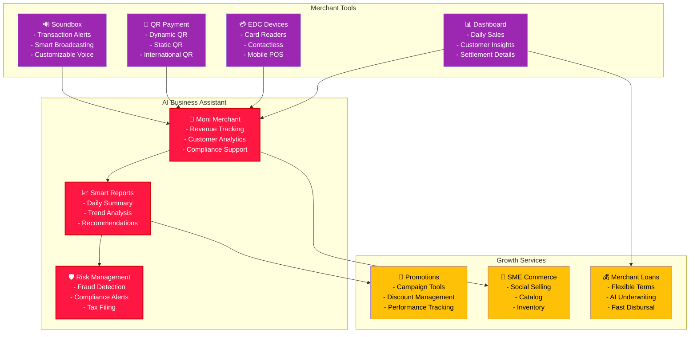
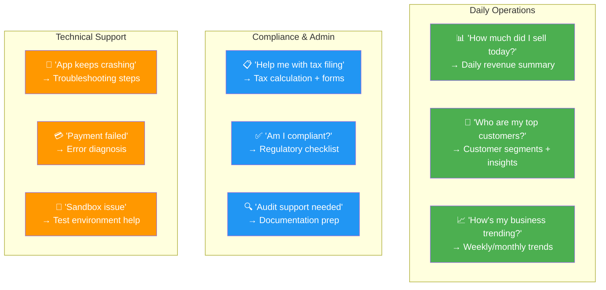
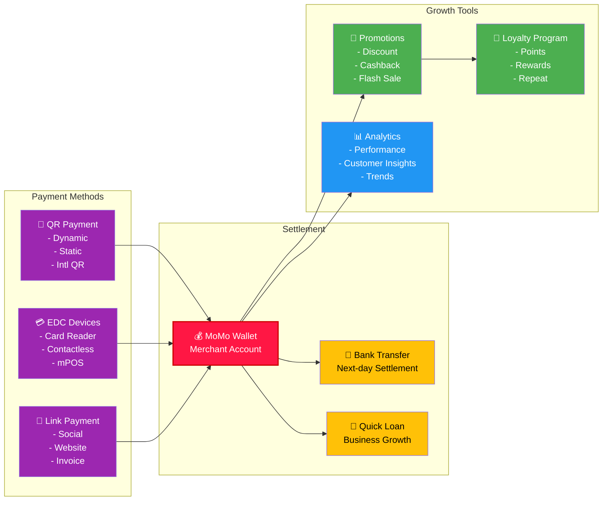
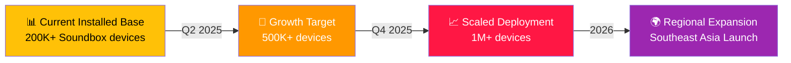
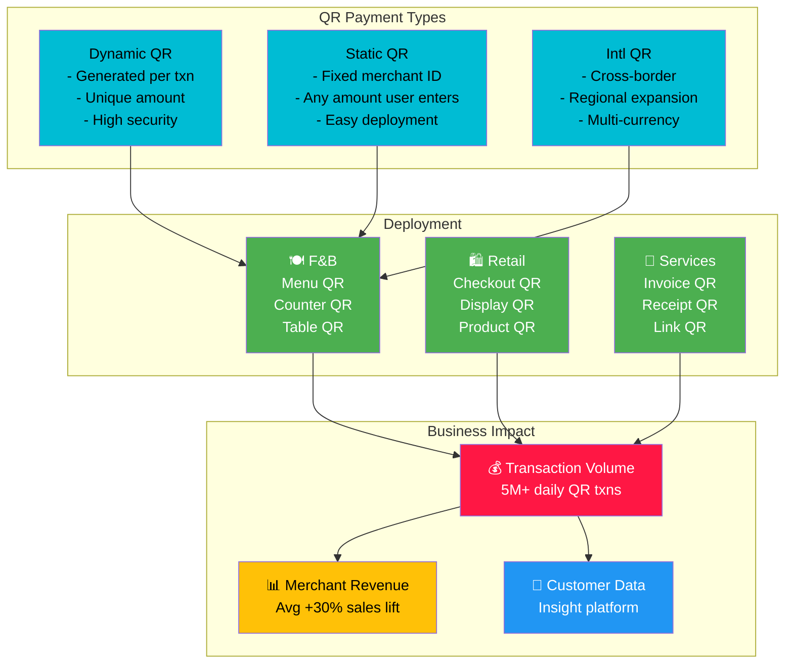
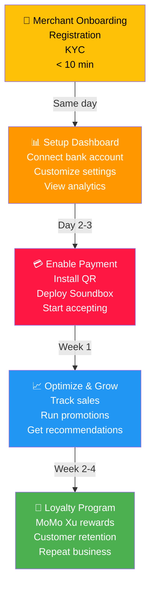
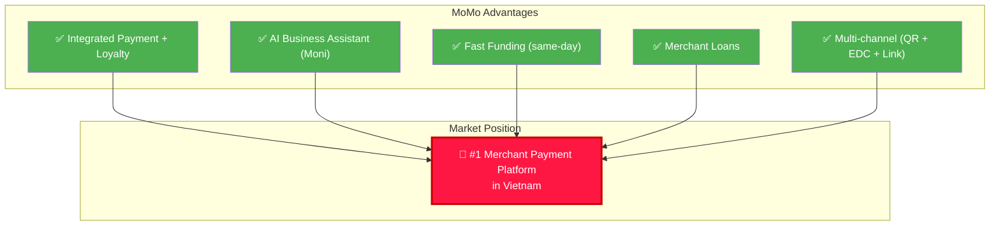

# 🏪 Business Solutions & Merchant Ecosystem

## Overview

MoMo Business Solutions empowers 1M+ merchants with AI-powered tools to operate more efficiently, reach customers, and grow their revenue.

---

## B2B Product Ecosystem

---

## Moni Merchant - AI Business Assistant

### What is Moni Merchant?

An AI chatbot agent that becomes a daily business assistant for merchants, helping with:
- **Business Operations**: Revenue tracking, customer insights, reporting
- **Compliance**: Tax support, filing assistance, regulatory compliance
- **Support**: App troubleshooting, error resolution, sandbox issues

### Moni Merchant Use Cases

---

## Merchant Payment Ecosystem

---

## Soundbox Product Details

### What is Soundbox?
MoMo's smart speaker for merchants that announces transactions in real-time with:
- **Transaction Alerts**: Customer name, amount, payment method
- **Smart Broadcasting**: Daily summaries, promotional announcements
- **Voice Customization**: Multiple voices, languages, tones
- **Intelligence**: Holiday-aware, time-aware messaging

### Soundbox Adoption

---

## QR Payment Strategy

---

## Merchant Engagement Funnel

---

## Key Business Metrics

| Metric | 2024 | 2025 Target | 2026 Target |
|--------|------|------------|-----------|
| Active Merchants | 700K | 1M | 1.5M |
| QR Payment Volume | 3M txn/day | 8M txn/day | 15M txn/day |
| Merchant GMV | $3B | $6B | $10B |
| Avg Merchant Daily Sales | $200 | $250 | $300 |
| Soundbox Deployments | 200K | 500K | 1M |
| Moni Merchant Conversations | 10M/month | 30M/month | 50M/month |
| Merchant NPS | 40 | 48 | 55 |

---

## Competitive Landscape

---

## Strategic Initiatives 2025-2026

**Q2 2025**: Moni Merchant expansion to 500K merchants
**Q3 2025**: International QR for regional expansion
**Q4 2025**: Merchant loyalty platform launch
**Q1 2026**: Enterprise offline payment platform
**Q2 2026**: Regional SME marketplace integration
**H2 2026**: Cross-border merchant ecosystem

---

## Related Documentation

- [Payment Services](./payments.md)
- [Financial Services - Merchant Loans](./financial-services.md)
- [Growth & Discovery](./growth-discovery.md)
- [Security & Compliance](./security-compliance.md)

---

**Last Updated**: July 2026 | **Owner**: Head of Enterprise Offline Payment
