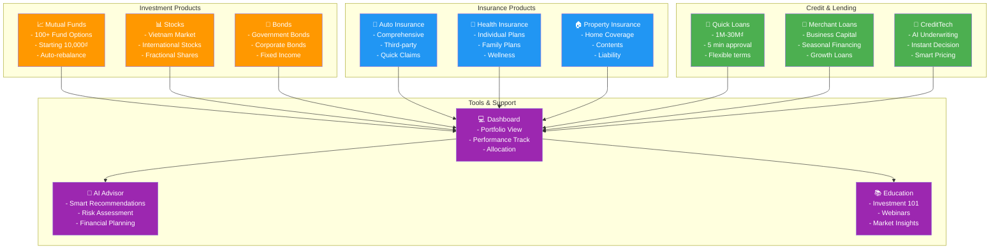
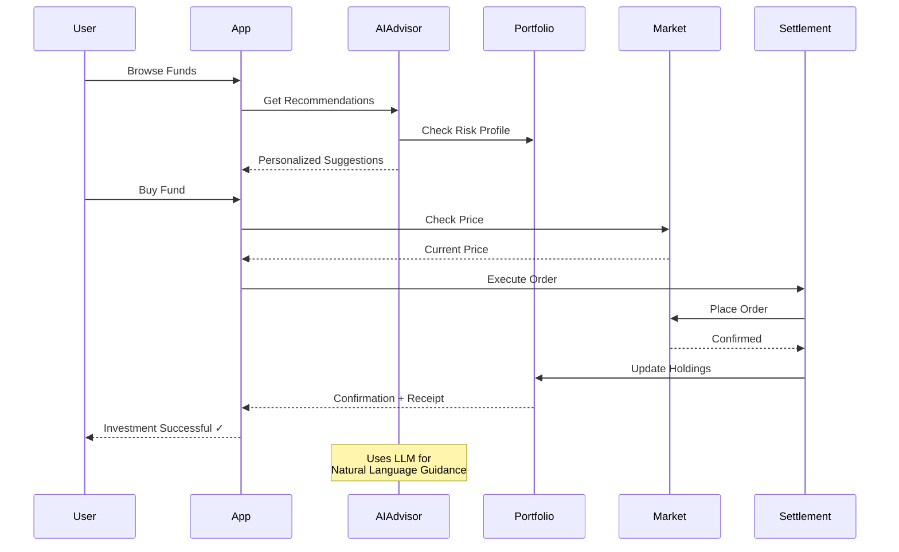
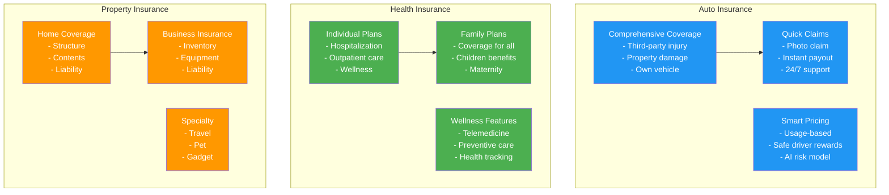
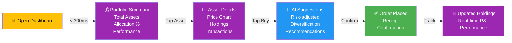
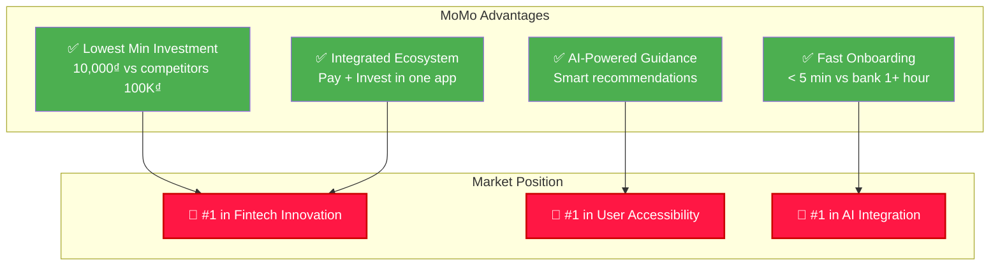

# 💰 Financial Services & Wealth

## Overview

MoMo's Financial Services enables users to build wealth through accessible investment, insurance, and lending products with AI-powered guidance.

---

## Financial Services Ecosystem

---

## Investment Platform Architecture

---

## Core Investment Products

### 💼 Mutual Funds
- **Options**: 100+ funds across categories
- **Min Investment**: 10,000₫ (lowest in market)
- **Categories**: Stocks, Bonds, Money Market, Balanced
- **Features**: Auto-rebalance, SIP (Systematic Investment Plan), Auto-dividend

### 📈 Stocks & Equities
- Direct access to Vietnam stock market
- Fractional share ownership
- International stocks (coming 2026)
- Real-time quotes and alerts

### 💎 Fixed Income
- Government bonds (secure returns)
- Corporate bonds (higher yield)
- Bond funds for diversification
- Ladder strategy tools

---

## Insurance Product Stack

---

## Lending & Credit Products

### 💸 Quick Loans
- **Amount**: 1M - 30M₫
- **Approval**: 5 minutes
- **Terms**: 1-24 months
- **Rate**: From 7.5% p.a.
- **Use Case**: Emergency funds, personal needs

### 🏪 Merchant Loans
- **Amount**: 5M - 500M₫
- **For**: Small business growth
- **Term**: 3-36 months
- **Process**: AI underwriting, same-day disbursement

### 🤖 CreditTech Platform
- AI-powered credit scoring
- Real-time underwriting
- Instantaneous approval
- Dynamic pricing based on risk

---

## Financial Dashboard User Journey

---

## AI-Powered Features

### 🤖 Smart Advisor
- Personalized recommendations based on:
  - Risk profile
  - Investment goals
  - Time horizon
  - Market conditions
- Natural language chat interface
- Educational content

### 📊 Automated Rebalancing
- Portfolio drift detection
- Optimal rebalancing suggestions
- Automatic tax-loss harvesting (coming 2026)
- Goal tracking

### 💡 Insights Engine
- Market analysis summaries
- Fund performance rankings
- Economic indicators
- Peer comparison

---

## Key Metrics & KPIs

| Metric | 2024 Target | 2025 Target | Owner |
|--------|------------|-----------|-------|
| Investment Platform MAU | 2M | 5M | Head of Product |
| AUM (Assets Under Management) | $1.5B | $3B | CRO |
| Avg. Customer AUM | $300 | $600 | Product |
| Fund Adoption Rate | 20% | 35% | Growth |
| Insurance Premium | $50M | $120M | Insurance Lead |
| Loan Book | $500M | $1.2B | CreditTech Head |
| Customer NPS | 42 | 48 | Product |

---

## Competitive Advantages

---

## 2025-2026 Roadmap

**Q1 2025**: International stock expansion, Crypto gateway
**Q2 2025**: Insurance product launch, CreditTech scale
**Q3 2025**: Wealth planning tools, Automated rebalancing
**Q4 2025**: AI financial advisor, Tax optimization
**2026**: Comprehensive wealth platform, Global integration

---

## Related Documentation

- [Payment Services](./payments.md)
- [Business Solutions](./business-solutions.md)
- [Growth & Discovery](./growth-discovery.md)
- [Security & Compliance](./security-compliance.md)

---

**Last Updated**: July 2026 | **Owner**: Head of CreditTech Product
