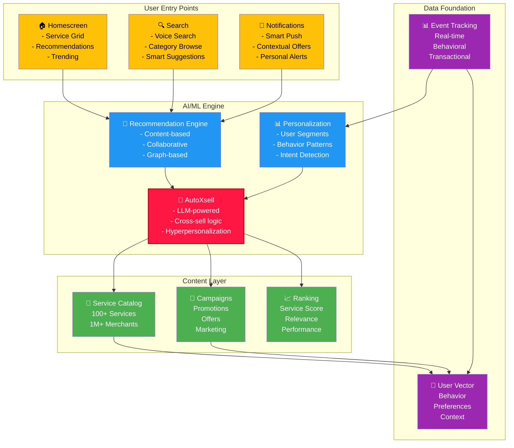
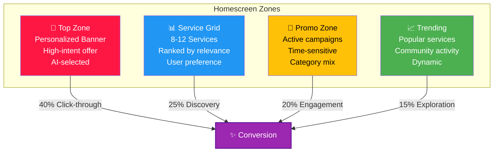
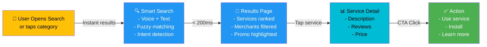
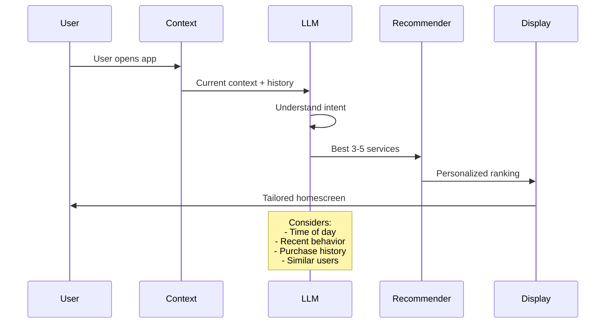
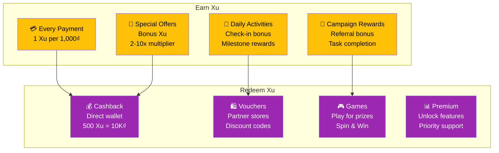
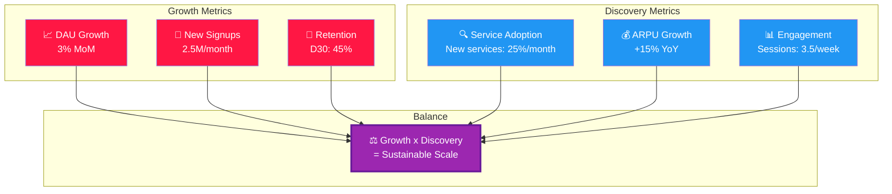
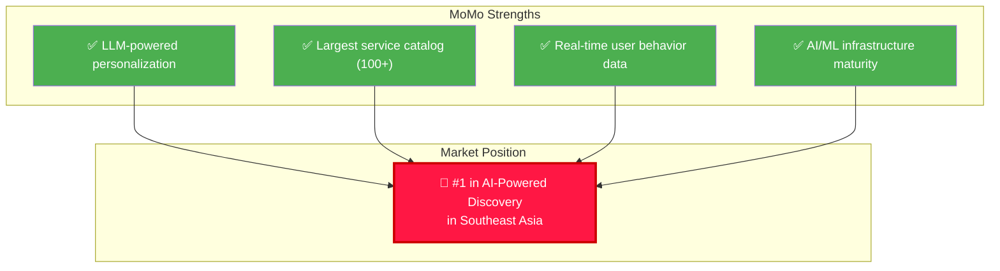

# 🔍 Growth & Discovery Platform

## Overview

MoMo's Growth & Discovery Platform is the intelligent engine that helps 30M+ users discover the right financial services at the right time through AI-powered personalization and seamless UX.

---

## Discovery Platform Architecture

---

## Homescreen Experience

### Current State

### 2025 Improvements
- Expanded personalization coverage
- Video preview support
- Subscription service promotion
- AI agent recommendations

---

## Search & Service Discovery

---

## AI Personalization Engines

### 🤖 AutoXsell - Hyperpersonalization

**What**: LLM-powered engine that understands user context and recommends services naturally

**How it works**:

**Results (2024-2026)**:
- 30% increase in service discovery traffic
- 55% increase in daily financial service registrations
- 10% reduction in single-use users

### 📊 Recommendation Engine

**Components**:
- **Content-based**: Similar services based on attributes
- **Collaborative Filtering**: Users like me also used X
- **Graph-based**: Relationship networks between services
- **Contextual**: Time, location, device, behavior

---

## Growth Loops

```mermaid
graph TB
    subgraph "Acquisition Loop"
        A1["👤 New User"] -->|"Onboarding"| A2["📱 First Service<br/>(Payment)"]
        A2 -->|"Success"| A3["🎁 Referral Bonus<br/>Invite Friends"]
        A3 -->|"Shared Link"| A4["👥 New Users<br/>via Referral"]
        A4 -->|"Loop"| A2
    end

    subgraph "Engagement Loop"
        E1["💳 Payment Service"] -->|"Success"| E2["🔍 Discovery<br/>Next Service"]
        E2 -->|"Cross-sell"| E3["💰 Finance Service<br/>(Invest/Loan)"]
        E3 -->|"Engagement"| E4["📊 Dashboard<br/>View Holdings"]
        E4 -->|"Habit"| E1
    end

    subgraph "Retention Loop"
        R1["📊 Regular Usage"] -->|"Points"| R2["🎁 MoMo Xu<br/>Rewards"]
        R2 -->|"Redeem"| R3["🛍️ Use Reward<br/>(Cashback/Voucher)"]
        R3 -->|"Habit"| R1
    end

    style A1 fill:#FFC107,color:#000
    style A2 fill:#FF1744,color:#fff
    style A3 fill:#FFC107,color:#000
    style A4 fill:#FF1744,color:#fff

    style E1 fill:#FF1744,color:#fff
    style E2 fill:#2196F3,color:#fff
    style E3 fill:#4CAF50,color:#fff
    style E4 fill:#9C27B0,color:#fff

    style R1 fill:#FF1744,color:#fff
    style R2 fill:#9C27B0,color:#fff
    style R3 fill:#FFC107,color:#000
```

---

## MoMo Xu Loyalty Program

### Program Structure

---

## Metrics & Analytics

### Discovery Platform KPIs

| Metric | 2024 | 2025 Target | Definition |
|--------|------|------------|-----------|
| Homescreen CTR | 35% | 45% | Clicks / Impressions |
| Service Discovery Rate | 45% | 60% | Users discovering 1+ new service/month |
| Cross-sell Rate | 30% | 45% | Users using 3+ service categories |
| Daily Service Usage | 2.1 | 2.8 | Avg services used per DAU |
| Personalization Accuracy | 72% | 82% | Relevant recommendation rate |
| MoMo Xu Participation | 55% | 75% | Active users in loyalty program |
| Referral Conversion | 18% | 28% | Signups from referral links |

---

## Growth vs Discovery Balance

---

## 2025-2026 Strategic Initiatives

### Q1-Q2 2025: Agentic Search
- Graph-based service discovery
- Natural language understanding
- Multi-step recommendation
- Expected: 25% improvement in discovery

### Q3-Q4 2025: AI Video Preview
- Auto-generated service videos
- Micro-interactions
- Contextual demos
- Expected: 30% CTR improvement

### 2026: Predictive Discovery
- Predict user needs before action
- Proactive service suggestions
- Seasonal/contextual awareness
- Expected: 40% increase in service adoption

---

## Competitive Positioning

---

## Related Documentation

- [Payment Services](./payments.md)
- [Financial Services](./financial-services.md)
- [Business Solutions](./business-solutions.md)
- [Security & Compliance](./security-compliance.md)

---

**Last Updated**: July 2026 | **Owner**: Head of Growth Platform Product
