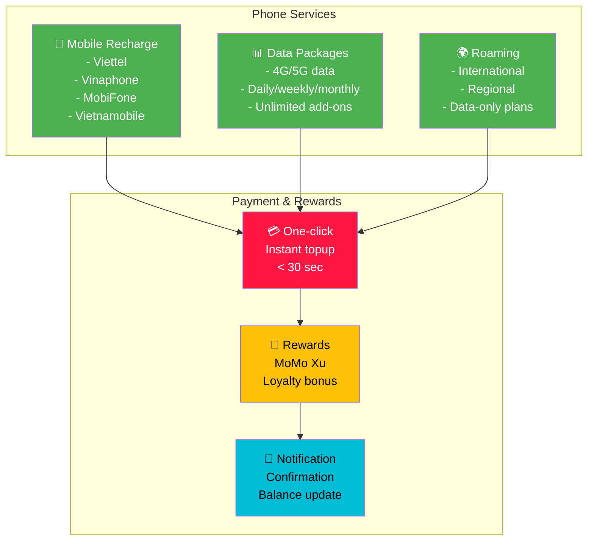
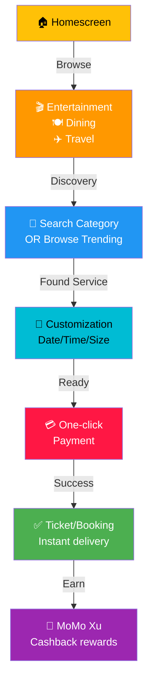
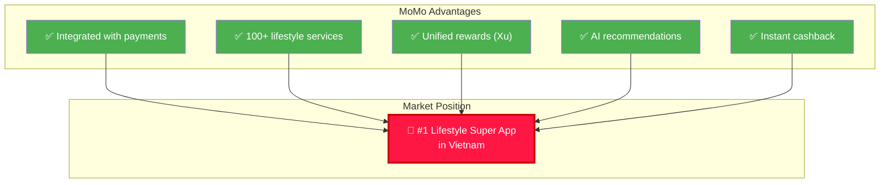

# 🎬 Lifestyle, Entertainment & Utilities

## Overview

MoMo's Lifestyle & Utilities ecosystem offers users convenience across entertainment, travel, dining, and daily utility services, making everyday life easier with seamless payment and integrated experiences.

---

## Lifestyle Ecosystem Map

```mermaid
graph TB
    subgraph "Entertainment"
        E1["🎬 Movies<br/>- Ticket booking<br/>- Early access<br/>- Exclusive shows"]
        E2["🎮 Games<br/>- Game credits<br/>- In-app purchases<br/>- Premium access"]
        E3["📺 Apps<br/>- App store<br/>- Subscriptions<br/>- Premium content"]
    end

    subgraph "Travel & Transport"
        T1["✈️ Flights<br/>- Booking<br/>- Cashback<br/>- Travel insurance"]
        T2["🚌 Bus Tickets<br/>- Domestic routes<br/>- Express buses<br/>- Group bookings"]
        T3["🚗 Ride Sharing<br/>- Taxi integration<br/>- Driver ratings<br/>- Group rides"]
    end

    subgraph "Utilities & Bills"
        U1["📱 Phone Services<br/>- Phone recharge<br/>- 4G/5G data<br/>- Roaming"]
        U2["⚡ Bills<br/>- Electricity<br/>- Water<br/>- Internet"]
        U3["🏠 Services<br/>- Home maintenance<br/>- Insurance<br/>- Delivery"]
    end

    subgraph "Food & Dining"
        F1["🍽️ Restaurants<br/>- Reservations<br/>- Special menus<br/>- Private dining"]
        F2["🥗 Food Delivery<br/>- Food ordering<br/>- Scheduled delivery<br/>- Group ordering"]
        F3["☕ Cafes & Bars<br/>- Coffee orders<br/>- Bar bookings<br/>- Events"]
    end

    E1 --> DISCOVERY["🔍 Unified Discovery"]
    E2 --> DISCOVERY
    E3 --> DISCOVERY
    T1 --> DISCOVERY
    T2 --> DISCOVERY
    T3 --> DISCOVERY
    U1 --> DISCOVERY
    U2 --> DISCOVERY
    U3 --> DISCOVERY
    F1 --> DISCOVERY
    F2 --> DISCOVERY
    F3 --> DISCOVERY

    DISCOVERY --> PAYMENT["💳 One-click Payment"]
    DISCOVERY --> REWARDS["🎁 Rewards & Cashback"]

    style E1 fill:#FF9800,color:#fff
    style E2 fill:#FF9800,color:#fff
    style E3 fill:#FF9800,color:#fff
    style T1 fill:#2196F3,color:#fff
    style T2 fill:#2196F3,color:#fff
    style T3 fill:#2196F3,color:#fff
    style U1 fill:#4CAF50,color:#fff
    style U2 fill:#4CAF50,color:#fff
    style U3 fill:#4CAF50,color:#fff
    style F1 fill:#9C27B0,color:#fff
    style F2 fill:#9C27B0,color:#fff
    style F3 fill:#9C27B0,color:#fff
    style DISCOVERY fill:#FFC107,color:#000,stroke:#FFA000,stroke-width:2px
    style PAYMENT fill:#FF1744,color:#fff,stroke:#C00,stroke-width:2px
    style REWARDS fill:#FF1744,color:#fff,stroke:#C00,stroke-width:2px
```

---

## Entertainment Services Details

### 🎬 Movie Tickets

**Features**:
- Browse cinema listings
- Real-time seat selection
- Mobile ticketing (no printing required)
- Early bird discounts
- Group bookings
- Special event access

**Performance**:
- 500K+ monthly users
- 50M+ tickets booked annually
- 4.7/5 average rating
- 20% cashback during promotions

**Integration**:
- Major cinema chains (CGV, Lotte, Galaxy, etc.)
- Event-specific promotions
- VIP early access
- Group reservation discounts

### 🎮 Gaming & In-app Purchases

**Supported Games**:
- PUBG, Free Fire, Arena of Valor
- Candy Crush, Monster Strike
- Dragon Nest, Lost Saga
- Ragnarok, Tik Tok

**MoMo Gaming Features**:
- Instant game credits
- Zero instant gratification delay
- Special bundle offers
- Referral bonus credits
- Exclusive skins/items

### 📺 App Store & Subscriptions

- Premium app access
- Streaming services (Netflix, Spotify, etc.)
- Magazine/comic subscriptions
- Cloud storage (iCloud)
- Gaming passes

---

## Travel & Transport Services

```mermaid
graph LR
    A["✈️ Need to Travel"] -->|"Browse options"| B["🔍 Search & Compare<br/>Price | Duration | Route"]
    B -->|"Select"| C["📝 Choose Date<br/>Flexible calendar<br/>Price comparison"]
    C -->|"Passenger Info"| D["👤 Enter Details<br/>Quick fill<br/>Saved passengers"]
    D -->|"Payment"| E["💳 MoMo Wallet<br/>One-click<br/>Cashback"]
    E -->|"Confirmation"| F["✅ E-ticket Ready<br/>Mobile boarding<br/>Travel insurance"]
    F -->|"Travel"| G["🎒 Smooth Journey<br/>Pre-checkin<br/>Seat tracking"]

    style A fill:#2196F3,color:#fff
    style B fill:#2196F3,color:#fff
    style C fill:#00BCD4,color:#000
    style D fill:#00BCD4,color:#000
    style E fill:#FF1744,color:#fff
    style F fill:#4CAF50,color:#fff
    style G fill:#4CAF50,color:#fff
```

**Services Offered**:

| Service | Coverage | Partners | Cashback |
|---------|----------|----------|----------|
| Flights | Domestic/International | Vietjet, Vietnam Airlines, Bamboo | 3-8% |
| Bus Tickets | 100+ routes nationwide | Futa, Limousine, Thaco | 5-15% |
| Ride Sharing | Ho Chi Minh, Hanoi, regional | Grab integration | 5-10% |
| Hotels | 50K+ hotels | Booking.com integration | 3-5% |

---

## Utilities & Bill Payment

### Phone Recharge & Data

**Key Features**:
- Instant activation
- Frequent buyer discounts
- Roaming packages
- Family plans
- Auto-recharge options

### Utilities & Bill Payment

**Supported Categories**:
- Electricity (EVN)
- Water (SAWACO, VIWACO, etc.)
- Internet (Viettel, FPT, etc.)
- Insurance premiums
- Tuition fees
- Healthcare bills

**Benefits**:
- Single payment platform
- Scheduled payments
- Payment history tracking
- Automatic reminders
- Bill download/archive

---

## Food & Dining Services

### Restaurant Booking

```mermaid
graph LR
    A["🍽️ Looking for restaurant"] -->|"Search"| B["🔍 Browse Restaurants<br/>Rating | Cuisine | Location"]
    B -->|"View details"| C["📍 Restaurant Info<br/>Menu | Pricing<br/>Reviews | Photos"]
    C -->|"Select time"| D["⏰ Reservation<br/>Date + Time<br/>Party size"]
    D -->|"Book"| E["💳 MoMo Payment<br/>Instant confirmation<br/>QR code"]
    E -->|"Arrive"| F["✅ Dining Experience<br/>Instant seating<br/>Pre-ordered menu"]

    style A fill:#9C27B0,color:#fff
    style B fill:#9C27B0,color:#fff
    style C fill:#FF9800,color:#fff
    style D fill:#FF9800,color:#fff
    style E fill:#FF1744,color:#fff
    style F fill:#4CAF50,color:#fff
```

### Food Delivery

**Features**:
- Unlimited restaurants (10K+)
- Real-time order tracking
- Group ordering
- Scheduled delivery
- Exclusive deals
- Food safety certification

**Merchant Support**:
- Restaurant commission (25-30%)
- Delivery partner integration
- Kitchen display system
- Analytics dashboard
- Marketing tools

---

## Lifestyle Service Metrics

| Category | Monthly Users | Revenue | Satisfaction |
|----------|---------------|---------|--------------|
| Movie Tickets | 1.2M | $15M | 4.7/5 |
| Gaming Credits | 800K | $12M | 4.6/5 |
| Phone/Data | 8M | $45M | 4.8/5 |
| Bill Payments | 3M | $20M | 4.5/5 |
| Travel Booking | 600K | $25M | 4.6/5 |
| Food Delivery | 2.5M | $35M | 4.4/5 |

---

## User Experience Flow - Lifestyle

---

## Strategic Initiatives 2025-2026

**Q2 2025**: Lifestyle marketplace launch, Partner ecosystem expansion
**Q3 2025**: Scheduled delivery feature, Premium memberships
**Q4 2025**: Smart recommendations, Seasonal packages
**2026**: Integrated experience platform, Global travel integration

---

## Competitive Positioning

---

## Related Documentation

- [Payment Services](./payments.md)
- [Growth & Discovery](./growth-discovery.md)
- [Business Solutions - Merchants](./business-solutions.md)

---

**Last Updated**: July 2026 | **Owner**: Head of Lifestyle & Entertainment
