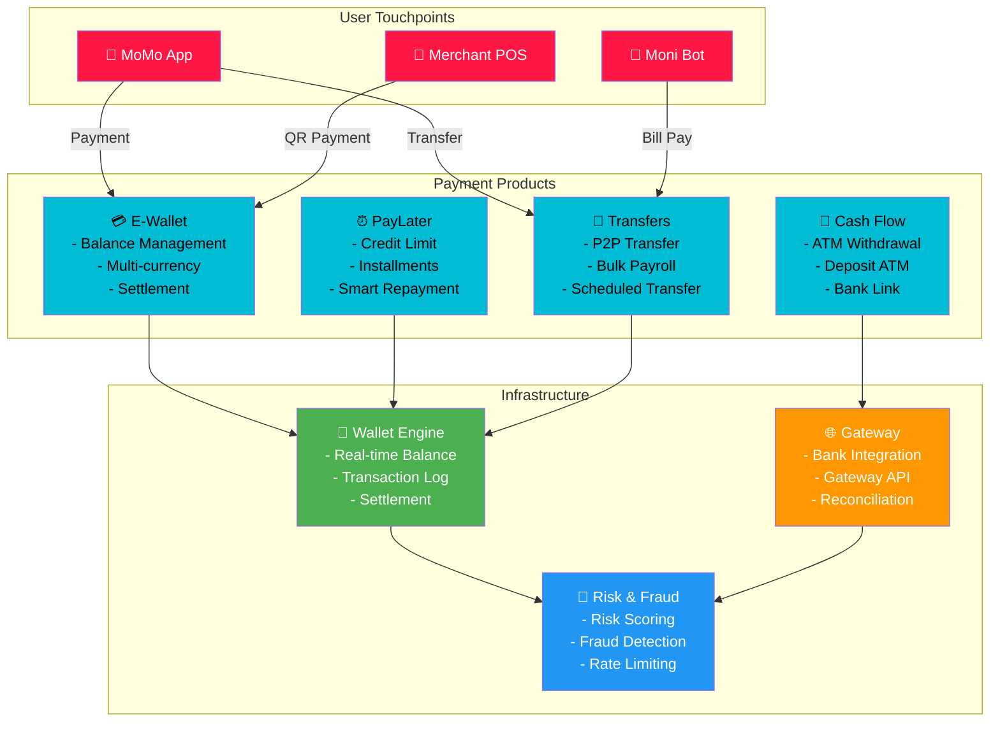
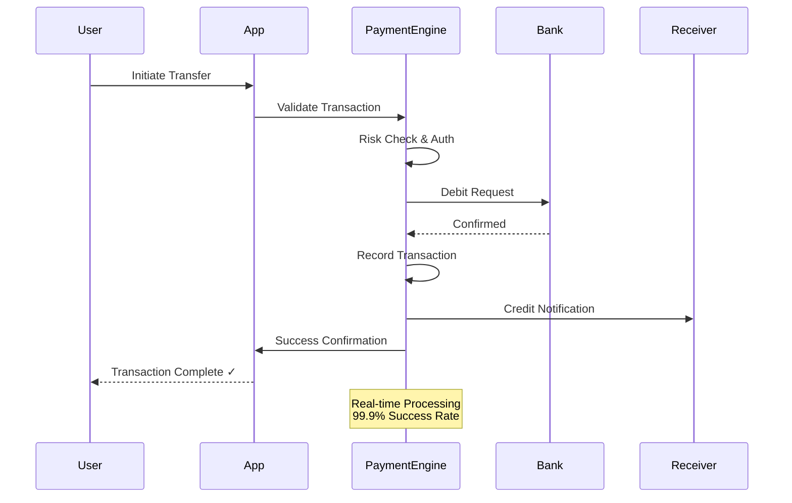
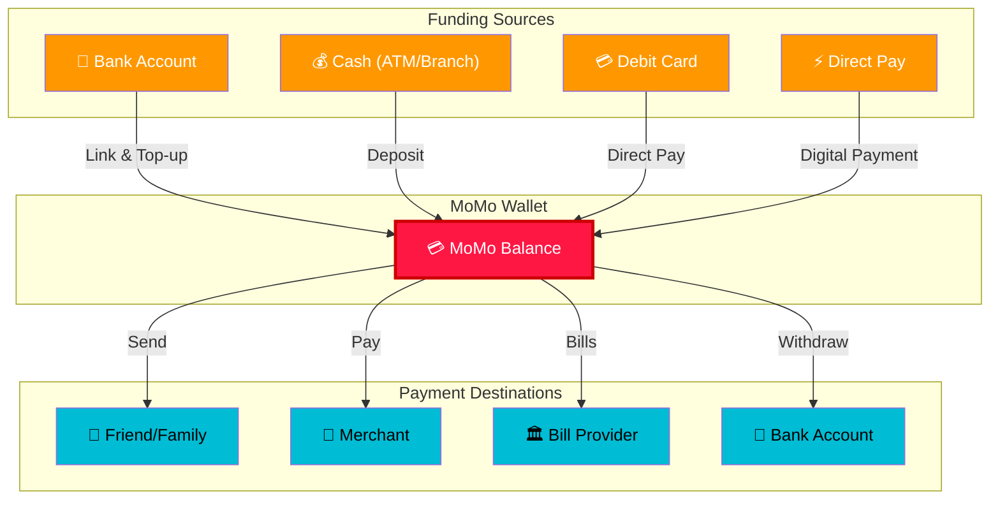
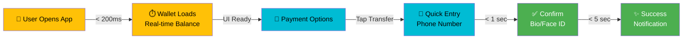

# 💳 Payment & Transfer Services

## Overview

Payment & Transfer is MoMo's core money movement engine, enabling millions of users to transfer funds instantly, safely, and conveniently.

---

## Product Architecture

---

## Payment Flow Diagram

---

## Core Products

### 1. **E-Wallet (Ví MoMo)**
- Real-time balance management
- Multi-currency support
- Instant peer-to-peer transfers
- **Daily Limit**: 500M₫ | **Monthly Limit**: 2B₫

### 2. **PayLater (Ví Trả Sau)**
- 0% interest payment later
- Flexible installments (3-12 months)
- Automatic reminder system
- Credit limit: 10M-100M₫

### 3. **Transfer Services**
- **Instant**: To MoMo users (< 5 sec)
- **Scheduled**: Future-dated transfers
- **Bulk**: Payroll & batch payments
- **International**: Regional remittance

### 4. **Cash Flow Management**
- Deposit ATMs across Vietnam
- Contactless ATM withdrawal
- Bank account linking
- Open banking integration

---

## Payment Methods Integration

---

## Key Metrics Dashboard

| Metric | 2024 Target | 2025 Target | Calculation |
|--------|------------|-----------|------------|
| Payment Success Rate | 99.8% | 99.95% | Successful Txn / Total Attempts |
| Avg Txn Settlement | < 100ms | < 50ms | P99 latency |
| Payment Volume (GMV) | $5B | $8B | Total transaction value |
| Daily Active Payers | 4M | 6M | Users making 1+ payment/day |
| Fraud Rate | < 0.01% | < 0.005% | Disputed txn / Total txn |
| PayLater Penetration | 15% | 25% | PayLater users / Total users |

---

## User Experience Optimization

---

## Strategic Initiatives 2025-2026

1. **Open Banking Integration**
   - Direct bank account linking
   - Multi-bank balance view
   - Unified payment experience

2. **Cross-Border Payments**
   - Regional remittance (Cambodia, Laos)
   - International transfers
   - Crypto gateway integration

3. **Merchant Ecosystem**
   - QR Payment ubiquity
   - Offline payment capability
   - Merchant settlement acceleration

4. **PayLater Scale**
   - Credit limit increase
   - Installment options expansion
   - Merchant adoption (F&B, Retail)

---

## Competitive Positioning

| Feature | MoMo | Bank Apps | Fintech Competitors |
|---------|------|-----------|-------------------|
| Instant Transfer | ✅ | 1-2 hours | ✅ |
| PayLater 0% | ✅ | Limited | ✅ |
| Merchant Coverage | ✅ | Basic | Basic |
| AI Features | ✅ | None | Limited |
| Accessibility | ✅ | Basic | Basic |

---

## Related Documentation

- [Business Solutions - Merchant Payments](./business-solutions.md)
- [Security & Compliance](./security-compliance.md)
- [Growth & Discovery Platform](./growth-discovery.md)

---

**Last Updated**: July 2026 | **Owner**: Head of Product, Payment & Transfer
