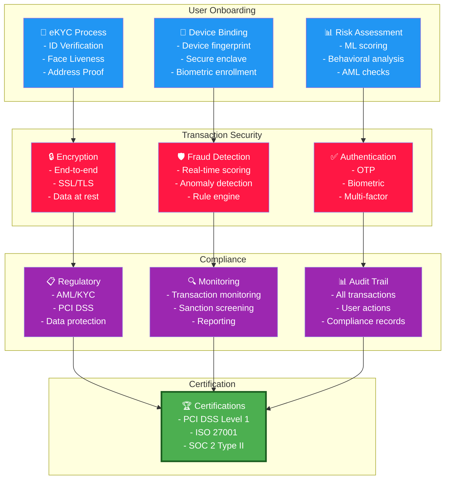
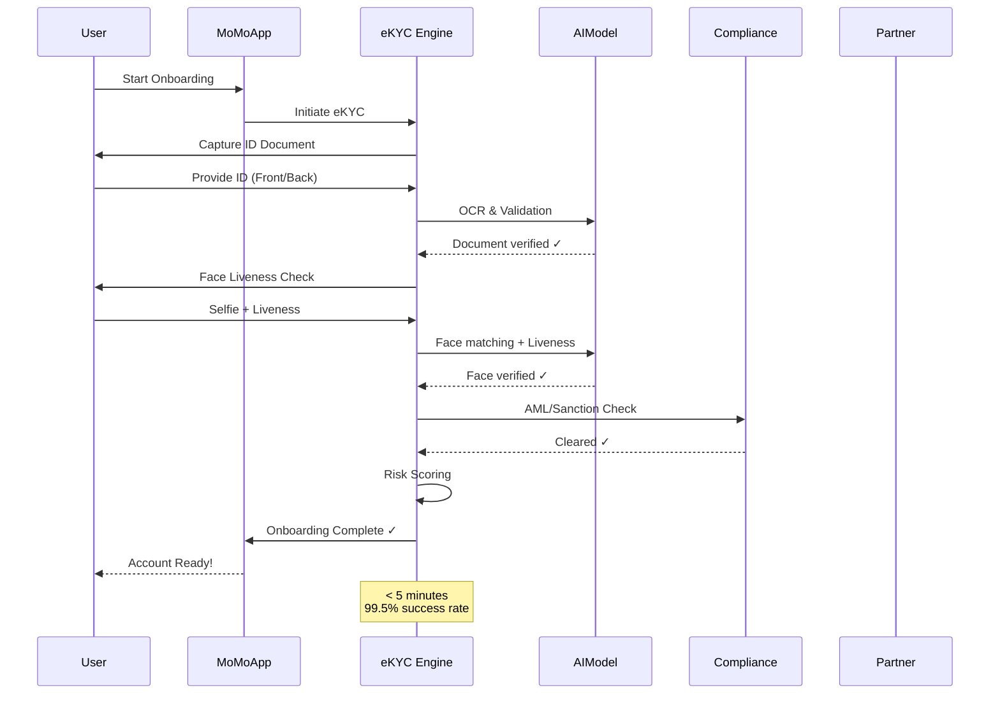
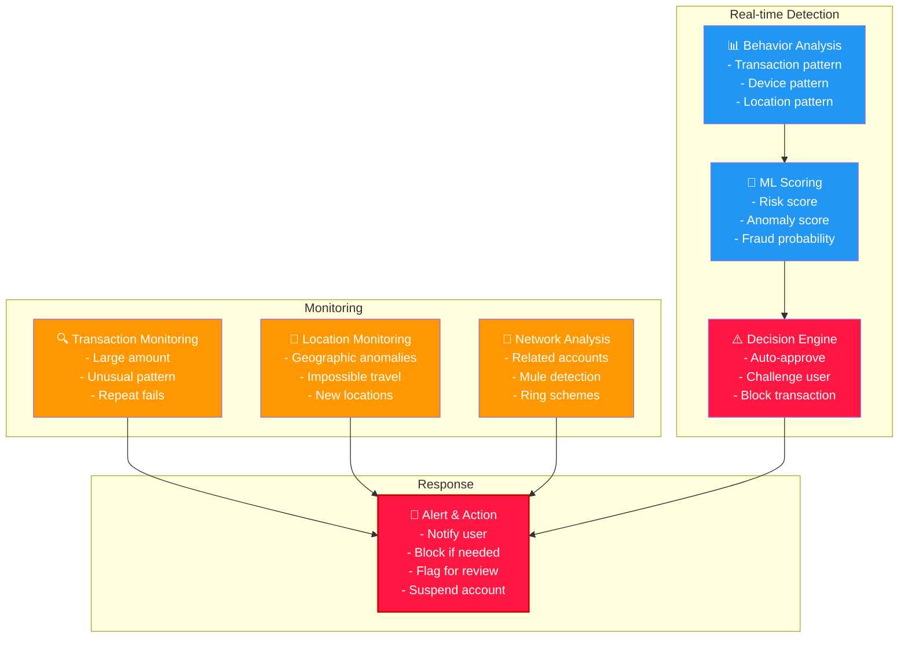
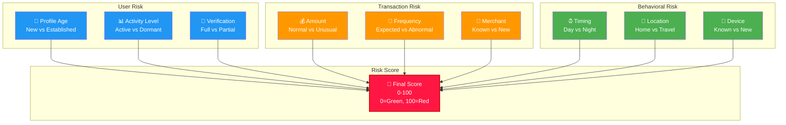
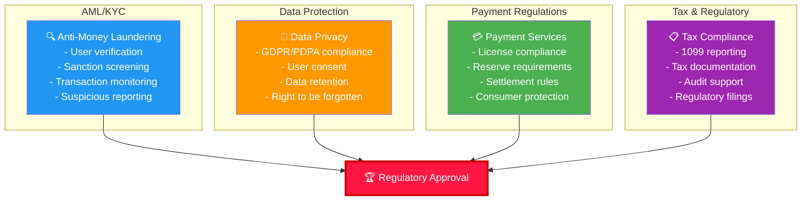
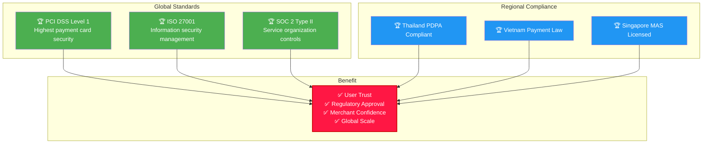
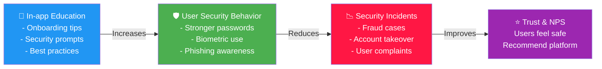

# 🛡️ Security, Compliance & eKYC

## Overview

MoMo's Security & Compliance platform ensures every transaction, user identity, and payment is verified, safe, and compliant with regulatory standards through advanced technology and AI-powered risk management.

---

## Security & eKYC Architecture

---

## eKYC Flow (Identity Verification)

---

## Fraud Detection System

---

## Risk Scoring Model

### Factors Considered

---

## Compliance & Regulatory Framework

### Key Compliance Domains

---

## Security Certifications

---

## Security Metrics

| Metric | Target | 2024 Actual | 2025 Target |
|--------|--------|------------|-----------|
| Fraud Rate | < 0.01% | 0.008% | < 0.005% |
| eKYC Success Rate | > 98% | 99.2% | 99.5% |
| Account Takeover Rate | < 0.001% | 0.0008% | < 0.0005% |
| Payment Failure (Security) | < 0.5% | 0.3% | < 0.2% |
| Compliance Incident | 0 | 0 | 0 |
| Avg Incident Response Time | < 1 hour | 15 min | < 10 min |
| User Satisfaction (Security) | > 4.5/5 | 4.7 | 4.8 |

---

## 2025-2026 Security Roadmap

**Q1 2025**: Enhanced ML fraud model, Real-time sanction screening
**Q2 2025**: Biometric 2FA rollout, Crypto payment security
**Q3 2025**: Advanced behavioral analysis, Merchant risk platform
**Q4 2025**: AI-powered compliance, Automated reporting
**2026**: Regional regulatory expansion, Global certification

---

## User Education & Awareness

---

## Related Documentation

- [Payment Services](./payments.md)
- [Business Solutions](./business-solutions.md)
- [Financial Services](./financial-services.md)
- [Growth & Discovery](./growth-discovery.md)

---

**Last Updated**: July 2026 | **Owner**: Head of Product, eKYC & Risk
