# Thiết kế sản phẩm SME Merchants – MoMo

## 1. Yêu cầu nghiệp vụ

### 1.1 Vấn đề cần giải quyết
Các merchant SME thường gặp ba rào cản chính: thiếu dữ liệu bán hàng theo thời gian thực, khó tiếp cận khách hàng mới và phải xử lý thủ công các công việc thuế, hóa đơn và chăm sóc khách hàng. MoMo cần cung cấp một bộ giải pháp giúp merchant tăng doanh thu, tối ưu chi phí marketing và giảm thao tác vận hành.

### 1.2 Đối tượng sử dụng chính
- Cửa hàng nhỏ / quán ăn / tiệm tiện lợi
- Chủ shop bán lẻ có ít nhân sự
- Merchant đang muốn mở rộng khách hàng mới và tăng tần suất mua hàng

### 1.3 Mục tiêu sản phẩm
- Tăng doanh thu trung bình trên mỗi merchant
- Giảm thời gian kiểm tra bán hàng và theo dõi hiệu quả
- Tự động tạo hóa đơn điện tử và nộp thuế đúng quy định
- Tối ưu chi phí marketing bằng Facebook Ads và Google Ads thay vì chỉ phụ thuộc vào SMS

### 1.4 KPI trọng tâm
| KPI | Mục tiêu |
|---|---:|
| Doanh thu/ngày | +15% trong 90 ngày |
| Tỷ lệ khách hàng quay lại | +10% |
| Chi phí thu hút khách hàng | Giảm 20% |
| Tỷ lệ hóa đơn tự động hóa | 90% |
| Tỷ lệ merchant active | 80% trong 30 ngày |

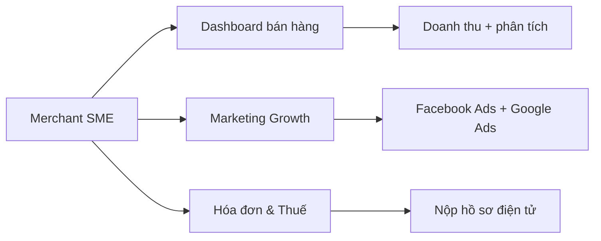

---

## 2. Thiết kế sản phẩm

### 2.1 Bộ sản phẩm cốt lõi

#### A. Merchant Dashboard
- Tổng quan doanh thu hôm nay, tuần, tháng
- Phân tích theo giờ, nhóm hàng và khách hàng
- Cảnh báo mục tiêu chưa đạt

#### B. Growth Marketing Suite
- Tạo chiến dịch quảng cáo trên Facebook Ads và Google Ads
- Theo dõi ROI, CPA, conversion và tỉ lệ quay lại
- Chọn đối tượng phù hợp theo khu vực, ngành hàng và hành vi mua

#### C. E-Invoice & Compliance
- Tự động sinh hóa đơn từ giao dịch QR
- Tính thuế và chuẩn bị hồ sơ nộp cho cơ quan thuế
- Ghi nhận trạng thái nộp và mã tham chiếu

### 2.2 Luồng hoạt động

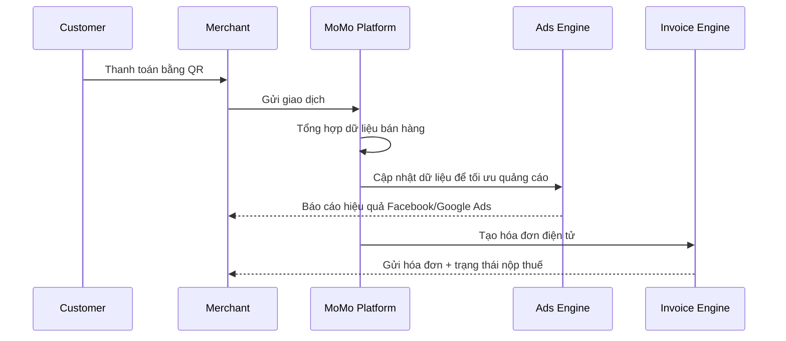

### 2.3 Kiến trúc hệ thống

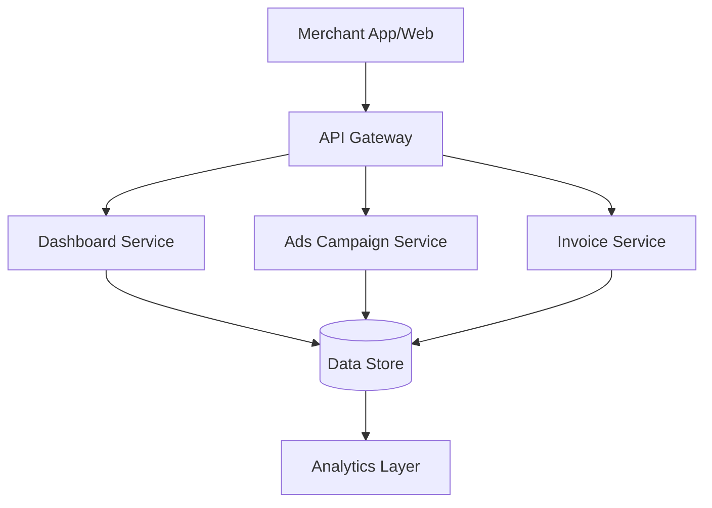

---

## 3. Wireframe UI cần thiết

### 3.1 Dashboard tổng quan merchant

```text
+-----------------------------------------------------------+
| MoMo Merchant Center                 [Báo cáo] [Cài đặt] |
|-----------------------------------------------------------|
| Tổng doanh thu hôm nay: 4.2M ₫   | Mục tiêu tháng: 5M ₫ |
| Tăng so với hôm qua: +150K ₫   | Tỷ lệ lặp lại: 35%     |
|-----------------------------------------------------------|
| [Doanh thu theo giờ] [Top sản phẩm] [Khách hàng quay lại] |
|-----------------------------------------------------------|
| 7 ngày gần nhất | 30 ngày gần nhất | Top nhóm hàng       |
+-----------------------------------------------------------+
```

### 3.2 Màn hình tạo chiến dịch quảng cáo

```text
+-----------------------------------------------------------+
| Tạo chiến dịch quảng cáo                                  |
|-----------------------------------------------------------|
| Nền tảng: [Facebook Ads] [Google Ads]                    |
| Mục tiêu: [Tăng bán hàng] [Tăng lưu lượng]                |
| Đối tượng: [Quận/Huyện] [Ngành hàng] [Tuổi] [Giới tính] |
| Ngân sách: 10,000,000 ₫ / ngày                            |
| Nội dung quảng cáo: [Text + Image + CTA]                  |
|-----------------------------------------------------------|
| [Lưu nháp] [Xem trước] [Đăng chiến dịch]                  |
+-----------------------------------------------------------+
```

### 3.3 Màn hình hiệu quả chiến dịch

```text
+-----------------------------------------------------------+
| Hiệu quả chiến dịch                                      |
|-----------------------------------------------------------|
| Tổng chi phí | 2.4M ₫ | Hiệu quả: 18% | CPA: 85K ₫        |
|-----------------------------------------------------------|
| [Biểu đồ conversion] [Biểu đồ ROI] [Top kênh hiệu quả]   |
|-----------------------------------------------------------|
| Facebook Ads: 12.4% CTR | Google Ads: 8.2% CTR          |
+-----------------------------------------------------------+
```

### 3.4 Wizard hóa đơn điện tử

```text
+-----------------------------------------------------------+
| Tạo hóa đơn điện tử                                      |
|-----------------------------------------------------------|
| Bước 1: Chọn giao dịch                                   |
| Bước 2: Kiểm tra thông tin khách hàng                    |
| Bước 3: Xác nhận thuế và nộp hồ sơ                       |
|-----------------------------------------------------------|
| [Quay lại] [Tiếp tục] [Hoàn thành]                        |
+-----------------------------------------------------------+
```

### 3.5 Sơ đồ thành phần UI

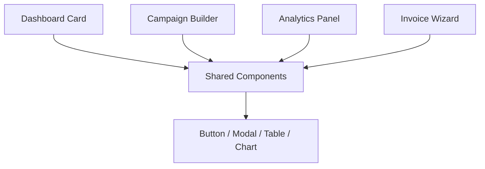

---

## 4. Mô hình dữ liệu và mapping UI

### 4.1 Mô hình dữ liệu chính

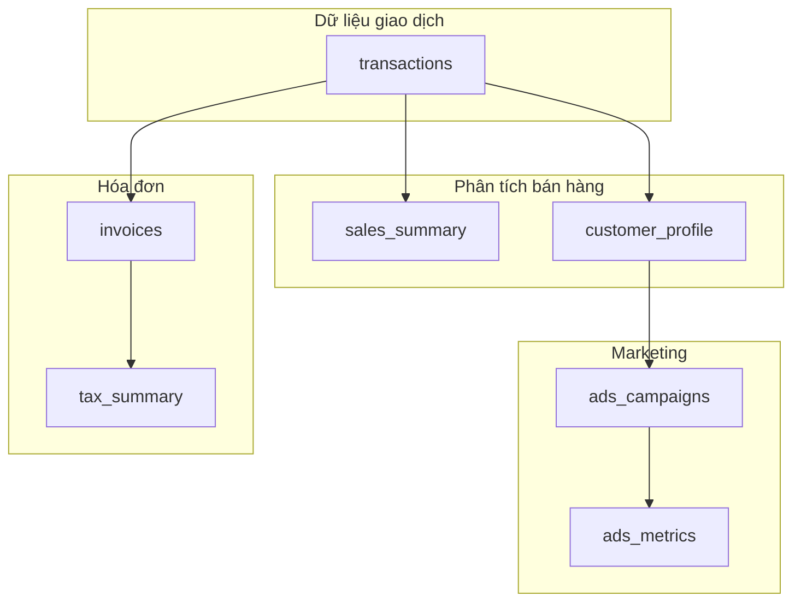

### 4.2 Mapping UI → dữ liệu

| UI màn hình | Dữ liệu nguồn | Trường chính |
|---|---|---|
| Dashboard doanh thu | sales_summary | revenue_today, revenue_week, target_progress |
| Campaign builder | ads_campaigns | campaign_name, platform, budget, objective |
| Analytics quảng cáo | ads_metrics | ctr, cpa, conversions, roi |
| Wizard hóa đơn | invoices | invoice_id, amount, tax_amount, status |

### 4.3 Mô hình dữ liệu rút gọn

```sql
CREATE TABLE ads_campaigns (
    campaign_id VARCHAR(50) PRIMARY KEY,
    merchant_id VARCHAR(50),
    platform VARCHAR(20),
    objective VARCHAR(50),
    budget BIGINT,
    status VARCHAR(20)
);

CREATE TABLE ads_metrics (
    campaign_id VARCHAR(50) PRIMARY KEY,
    impressions INT,
    clicks INT,
    conversions INT,
    cpa BIGINT,
    roi DECIMAL(5,2)
);

CREATE TABLE invoices (
    invoice_id VARCHAR(50) PRIMARY KEY,
    merchant_id VARCHAR(50),
    txn_id VARCHAR(50),
    amount BIGINT,
    tax_amount BIGINT,
    status VARCHAR(20)
);
```

### 4.4 Luồng dữ liệu chủ đạo

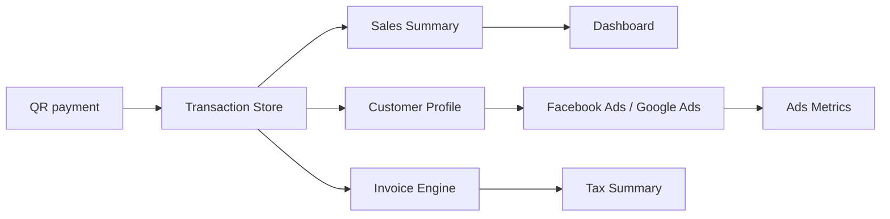

---

## 5. JD Mapping & Interview Prep

### 5.1 Góc nhìn sản phẩm cho JD này

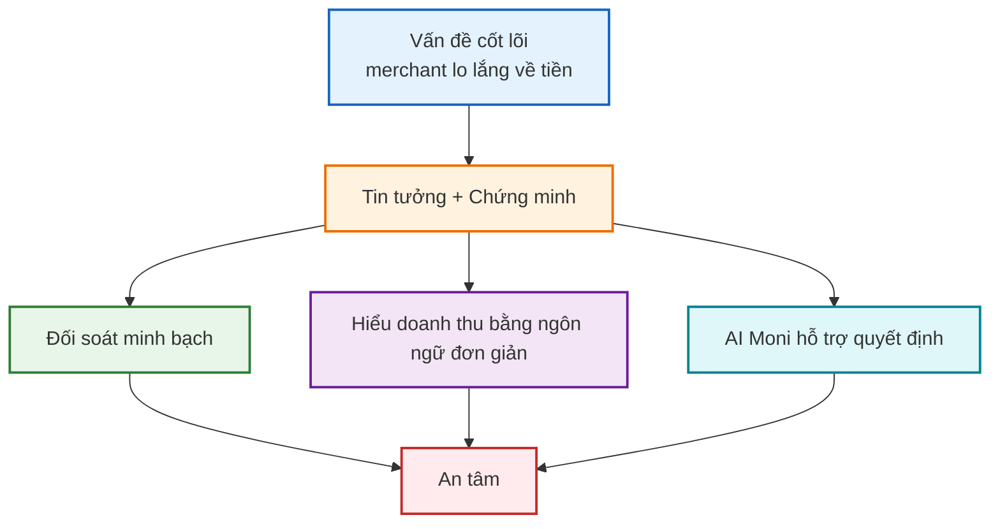

### 5.2 Merchant journey nhanh

```mermaid
flowchart LR
    A["Khách hàng thanh toán"] --> B["Giao dịch vào hệ thống"]
    B --> C["Sổ Thu Chi / Widget Home"]
    C --> D["Merchant thấy rõ doanh thu"]
    D --> E["Tăng trust + quay lại dùng"]
    E --> F["Mở rộng bán hàng & tiếp cận vốn"]

    style A fill:#FFF8E1,stroke:#F9A825,stroke-width:2px
    style B fill:#E3F2FD,stroke:#1565C0,stroke-width:2px
    style C fill:#E8F5E9,stroke:#2E7D32,stroke-width:2px
    style D fill:#F3E5F5,stroke:#6A1B9A,stroke-width:2px
    style E fill:#E0F7FA,stroke:#00838F,stroke-width:2px
    style F fill:#FFEBEE,stroke:#C62828,stroke-width:2px
```

### 5.3 Chu trình chỉ số cho sản phẩm

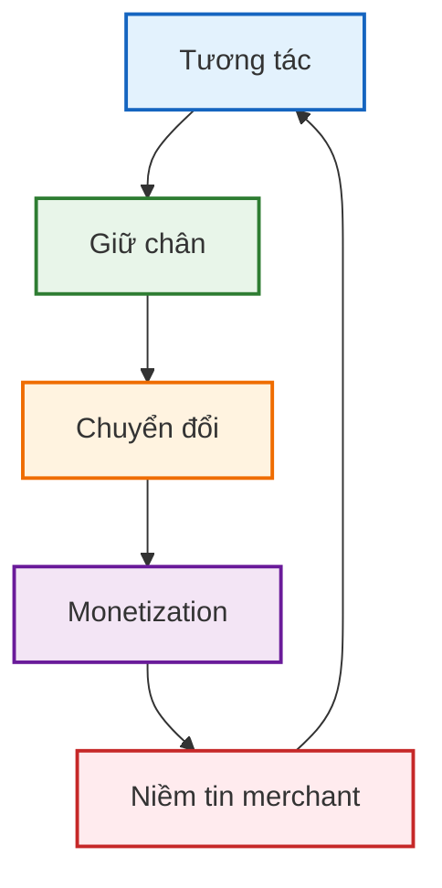

### 5.4 Thực thi đa bộ phận

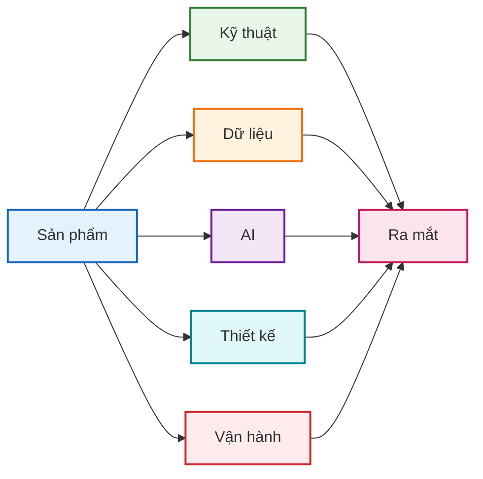

### 5.5 Hỏi đáp ngắn gọn cho phỏng vấn

- Q: JD này nói về gì?  
  A: Xây dựng sản phẩm đặt merchant làm trung tâm, giúp SME tin tưởng vào dòng tiền, hiểu rõ hoạt động kinh doanh và phát triển nhờ dữ liệu và AI.

- Q: Vì sao engagement của merchant lại quan trọng?  
  A: Vì merchant cần sự an tâm, không chỉ là các tính năng. Khi họ tin tưởng sản phẩm, họ sẽ dùng thường xuyên và gắn bó lâu hơn.

- Q: Bạn sẽ tiếp cận research người dùng như thế nào?  
  A: Bắt đầu từ phỏng vấn thực địa, quan sát merchant lớn tuổi và ít quen công nghệ, rồi chuyển ngôn ngữ của họ thành user stories rõ ràng.

- Q: Những metric nào quan trọng nhất?  
  A: Tương tác, giữ chân, chuyển đổi, tác động doanh thu và độ ổn định sau khi ra mắt.

- Q: Bạn sẽ ưu tiên feature như thế nào?  
  A: Dùng tư duy Jobs-to-be-Done: giải quyết trust + proof trước, rồi đơn giản trải nghiệm và giảm friction.

- Q: Vai trò của AI là gì?  
  A: AI nên làm việc dễ hơn, không phức tạp hơn. Moni cần giúp merchant ra quyết định nhanh hơn bằng gợi ý đơn giản và hữu ích.

- Q: Điều gì làm nên một Product Trainee tốt ở đây?  
  A: Curiosity, chủ động, đồng cảm với merchant, giao tiếp tốt và biết biến dữ liệu thành hành động.

---

## 6. Roadmap triển khai

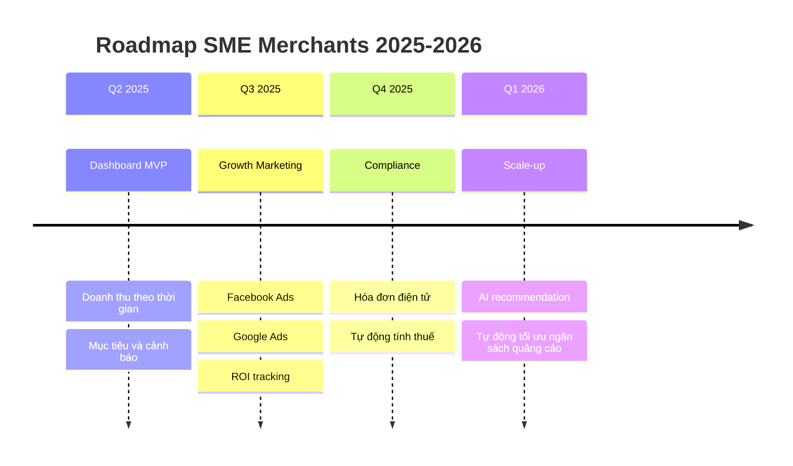

---

**Phiên bản**: 2.1  
**Ngày cập nhật**: 15/07/2026  
**Trạng thái**: Sẵn sàng cho kickoff engineering và phỏng vấn
