# 🏪 SME Payment & Business Solutions - Product Design Guide

**Focus Area**: Merchant Engagement & Monetization  
**Product Manager Role**: Manager - New Business and Product Development (SME Merchants)  
**Market**: SMEs, Small Merchants, Household Businesses in Vietnam  
**Mission**: Build 0→1 products that help merchants go beyond payments to manage, grow, and scale their business

---

## 📋 Table of Contents

1. [Business Requirements](#business-requirements)
2. [Product Design Architecture](#product-design-architecture)
3. [Product Samples & UX/UI Artifacts](#product-samples--uxui-artifacts)
4. [Data Schema & UI Mapping](#data-schema--ui-mapping)

---

---

# 1. BUSINESS REQUIREMENTS

## 1.1 Market Opportunity & Context

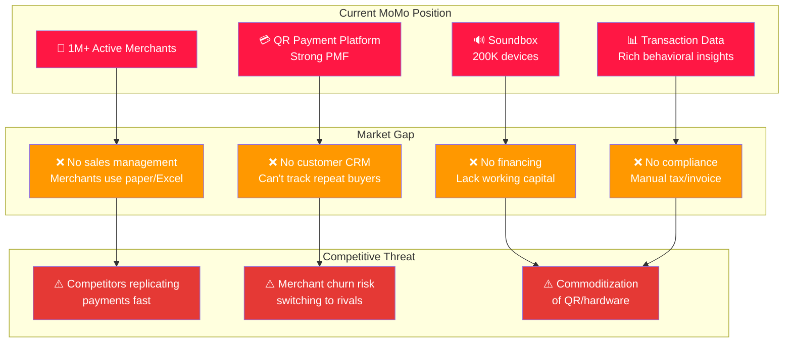

## 1.2 Business Objectives (0→1 Phase)

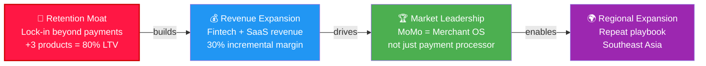

## 1.3 Merchant Personas & Pain Points

### Persona A: 🍜 Street Food Vendor

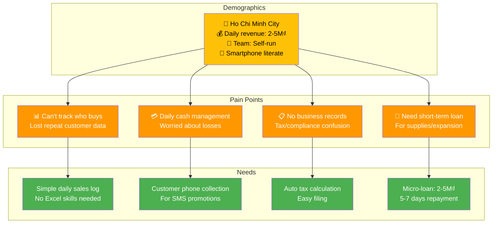

### Persona B: 🏪 Retail Shop Owner

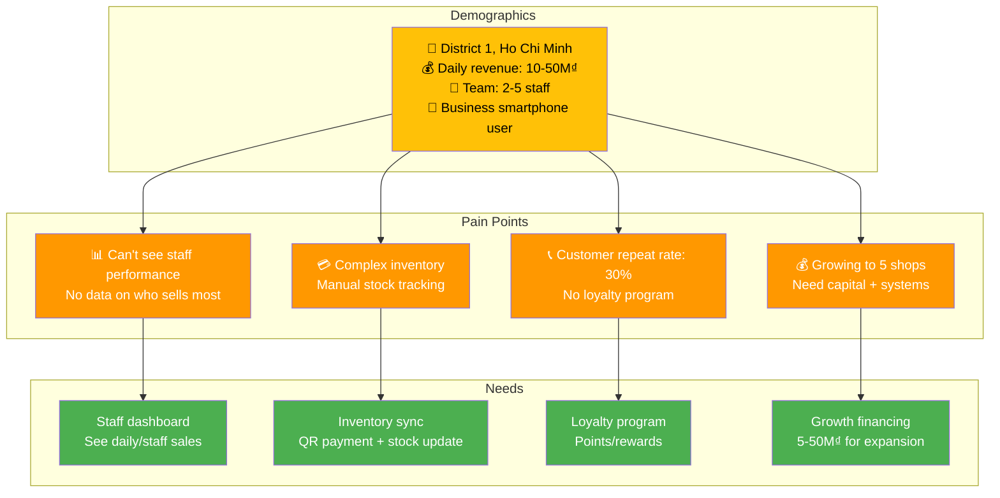

## 1.4 Product Portfolio Strategy (Year 1)

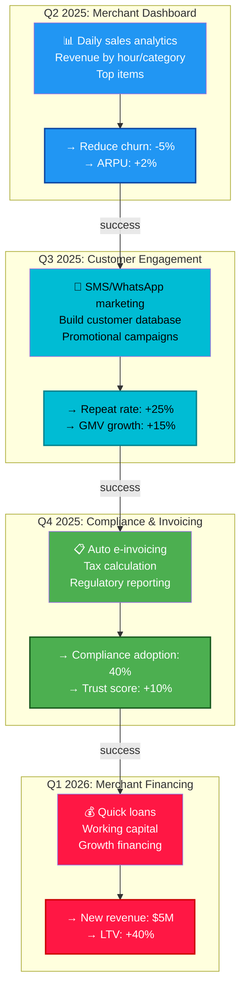

## 1.5 Success Metrics & Business KPIs

### Tier 1: Retention & Engagement

| Metric | Baseline 2024 | Q4 2025 Target | 2026 Target | Why It Matters |
|--------|--------------|----------------|------------|----------------|
| Merchant Churn | 25% annual | 20% | 15% | Core survival metric |
| Engaged Merchants (using 2+ features) | 30% | 55% | 75% | Cross-sell success |
| Avg Revenue per Merchant | $200/year | $350/year | $600/year | Monetization |
| Merchant NPS | 42 | 50 | 55 | Loyalty & advocacy |

### Tier 2: Product Adoption

| Metric | Q1 Launch | Q2 | Q3 | Q4 |
|--------|-----------|----|----|-----|
| Dashboard Adoption | 20% | 35% | 50% | 65% |
| SMS Campaign MAU | 5% | 12% | 25% | 40% |
| E-Invoice Adoption | - | - | 15% | 35% |
| Loan Applications | - | - | - | 5% |

### Tier 3: Revenue & Profitability

| Product | Year 1 Revenue Target | Gross Margin | Strategy |
|---------|--------|---------|----------|
| Dashboard (SaaS) | $800K | 75% | Freemium + premium |
| SMS Marketing | $1.2M | 70% | Pay-per-campaign |
| E-Invoice & Tax | $500K | 80% | Per-filing fee |
| Merchant Loans | $5M | 15% | Interest + fees |

---

---

# 2. PRODUCT DESIGN ARCHITECTURE

## 2.1 Merchant Ecosystem Map

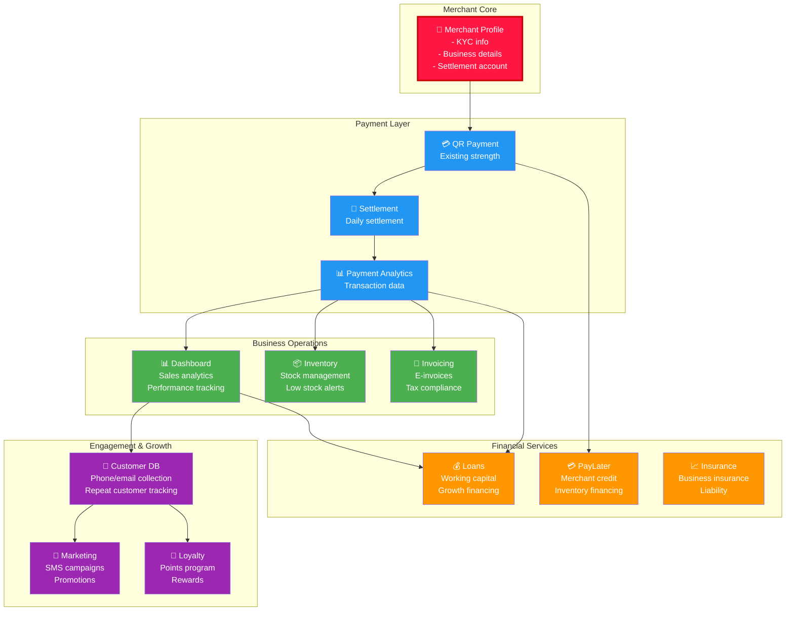

## 2.2 Product 1: Merchant Dashboard (Q2 2025)

### 2.2.1 Problem & Solution

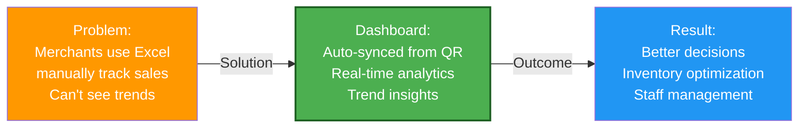

### 2.2.2 Feature Breakdown

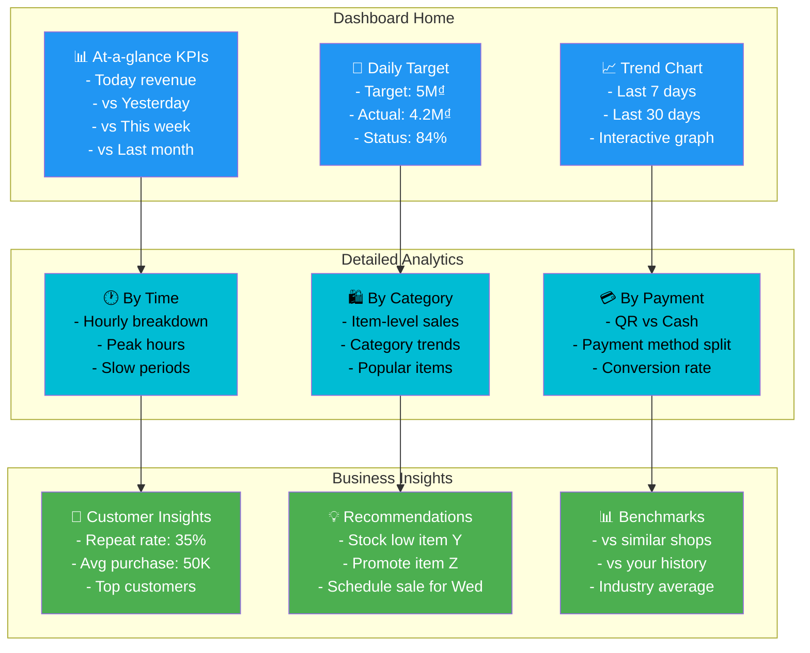

### 2.2.3 Data Flow: QR Payment → Dashboard

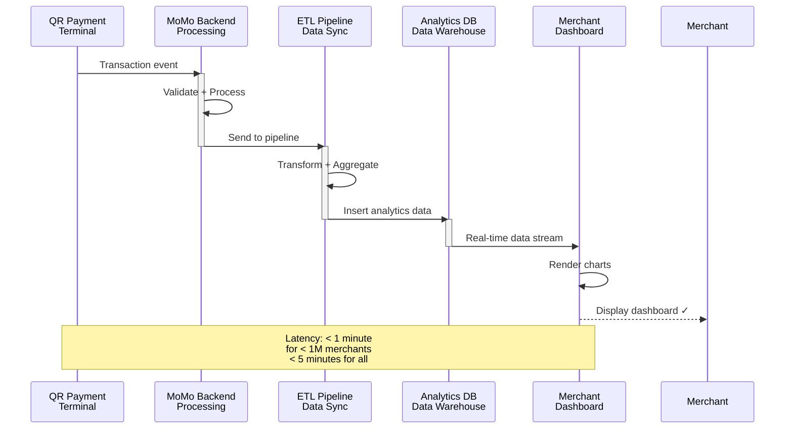

## 2.3 Product 2: Customer Engagement Platform (Q3 2025)

### 2.3.1 Architecture

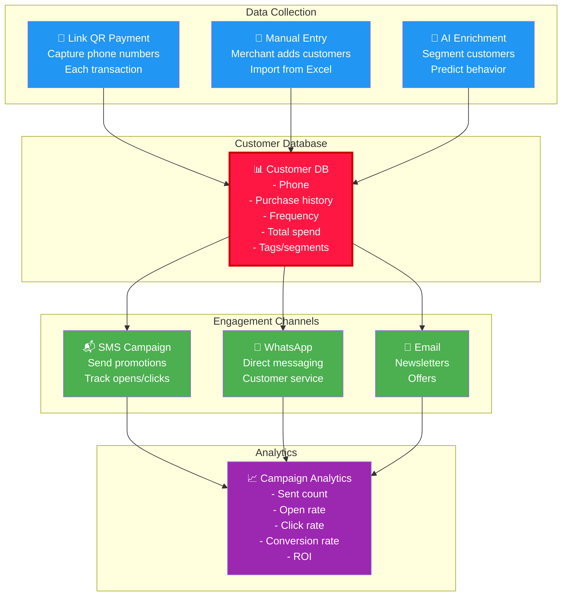

### 2.3.2 Features & Use Cases

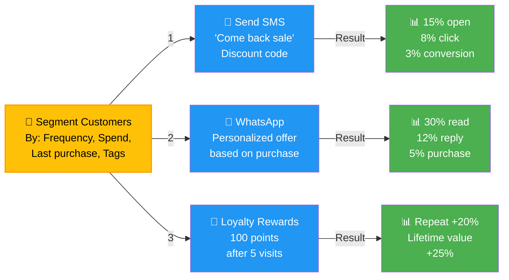

## 2.4 Product 3: E-Invoice & Compliance (Q4 2025)

### 2.4.1 Problem & Solution

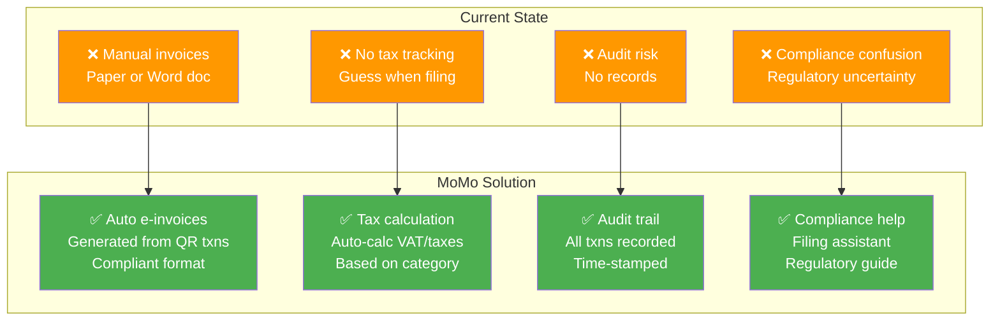

### 2.4.2 Workflow: Auto E-Invoice Generation

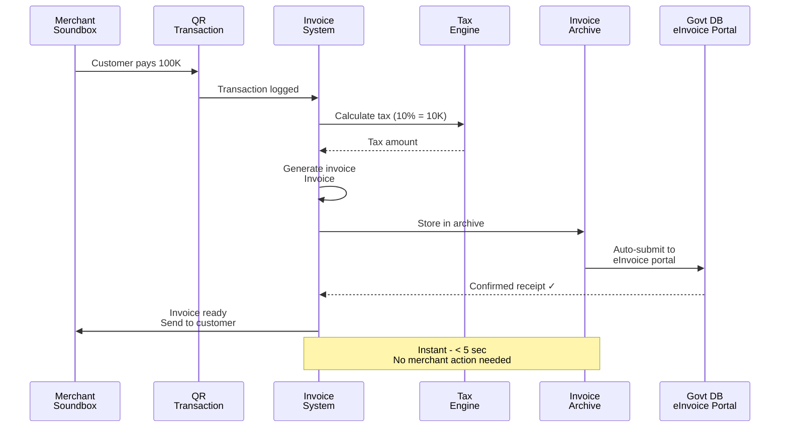

---

---

# 3. PRODUCT SAMPLES & UX/UI ARTIFACTS

## 3.1 Merchant Dashboard - UI Wireframe

### Home Screen

```
┌───────────────────────────────────────┐
│          🏪 Merchant Dashboard         │
│                                       │
├─ TODAY ─────────────────────────────┤
│                                       │
│  💰 Revenue Today        📊 Target    │
│  ┌─────────────────────┐ ┌─────────┐ │
│  │     4.2M ₫          │ │ 84% 🟢  │ │
│  │   vs Yest: +150K ↑  │ │ 5M ₫    │ │
│  └─────────────────────┘ └─────────┘ │
│                                       │
│  📈 Last 7 Days Revenue               │
│  ┌─────────────────────────────────┐ │
│  │     ╱╲   ╱╲                      │ │
│  │    ╱  ╲ ╱  ╲  ╱╲   ╱╲           │ │
│  │   ╱    ╱     ╲╱  ╲╱   ╲        │ │
│  │  Mon Tue Wed Thu Fri Sat Sun    │ │
│  │  3.2  3.8  4.1  3.9  4.5 4.2 M₫│ │
│  └─────────────────────────────────┘ │
│                                       │
├─ BREAKDOWN ──────────────────────────┤
│                                       │
│  🕐 By Hour       🛍️ By Category     │
│  ├─ 9-10am: 800K   ├─ Bún phở: 1.8M  │
│  ├─ 10-11am: 900K  ├─ Egg roll: 900K │
│  ├─ 11-12: 1.2M    ├─ Soup: 600K     │
│  ├─ 12-1pm: 800K   └─ Drink: 300K    │
│  └─ More...                          │
│                                       │
│  [View More] [Export] [Share]        │
└───────────────────────────────────────┘
```

### Detailed Analytics Screen

```
┌───────────────────────────────────────┐
│       📊 Detailed Analytics           │
├─────────────────────────────────────┤
│                                       │
│  Period: [This Month ▼]              │
│                                       │
│  ┌─ SUMMARY ───────────────────────┐ │
│  │ Total Revenue:  90M₫            │ │
│  │ Transactions:   2,450           │ │
│  │ Avg Order:      36.7K₫          │ │
│  │ Repeat Rate:    32%             │ │
│  └─────────────────────────────────┘ │
│                                       │
│  ┌─ TOP ITEMS ──────────────────────┐ │
│  │ 1. Bún phở special   35% | 15.8M│ │
│  │ 2. Egg roll          28% | 12.6M│ │
│  │ 3. Spring roll       22% | 9.9M │ │
│  │ 4. Soup              15% | 6.7M │ │
│  └─────────────────────────────────┘ │
│                                       │
│  ┌─ TOP CUSTOMERS ──────────────────┐│
│  │ 1. Nguyễn Văn A    45 visits     │ │
│  │    └─ Total spent: 2.3M₫         │ │
│  │ 2. Trần Thị B      32 visits     │ │
│  │    └─ Total spent: 1.8M₫         │ │
│  └─────────────────────────────────┘ │
│                                       │
│  [Print Report] [Send Email] [Export]│
└───────────────────────────────────────┘
```

## 3.2 Customer Engagement Platform - UI Wireframe

### SMS Campaign Builder

```
┌───────────────────────────────────────┐
│    📬 Create SMS Campaign              │
├─────────────────────────────────────┤
│                                       │
│  Campaign Name:                      │
│  [Enter campaign name________]      │
│                                       │
│  Target Segment: [Choose ▼]          │
│  ├─ All customers (847)              │
│  ├─ Frequent buyers (250) *          │
│  ├─ First-time (120)                 │
│  ├─ Inactive 30 days (45)            │
│  └─ Custom filter...                 │
│                                       │
│  Message Template:                   │
│  ┌───────────────────────────────────┐│
│  │ Hi {name}! 🎉                      ││
│  │                                    ││
│  │ Come back to our shop today!      ││
│  │ Show code: COMEBACK20 for          ││
│  │ 20% off your next order ❤️        ││
│  │                                    ││
│  │ Valid today only!                  ││
│  │ Order now: [Link]                  ││
│  └───────────────────────────────────┘│
│  [120/160 characters]                │
│                                       │
│  Schedule:                           │
│  ○ Send now                          │
│  ◉ Schedule for: [2pm Today ▼]      │
│                                       │
│  Estimated Reach: 250 SMS            │
│  Cost: 125K₫ (at 500₫/SMS)          │
│                                       │
│  [Preview] [Save Draft] [Send SMS]   │
└───────────────────────────────────────┘
```

### Campaign Analytics Dashboard

```
┌───────────────────────────────────────┐
│    📊 Campaign Performance             │
├─────────────────────────────────────┤
│                                       │
│  Campaign: "Comeback20 Sale"         │
│  Sent: July 10 at 2:00 PM            │
│  Status: ✓ Completed                 │
│                                       │
│  ┌─ CORE METRICS ──────────────────┐ │
│  │ Sent:        250 SMS            │ │
│  │ Delivered:   248 (99.2%) ✓      │ │
│  │ Failed:      2 (0.8%)           │ │
│  │ Read Rate:   78 (31.4%)         │ │
│  │ Click Rate:  32 (12.9%)         │ │
│  │ Conversion:  8 orders (3.2%)    │ │
│  └─────────────────────────────────┘ │
│                                       │
│  ┌─ REVENUE IMPACT ────────────────┐ │
│  │ Total Orders: 8                 │ │
│  │ Order Value: 45K₫ avg           │ │
│  │ Revenue: 360K₫                  │ │
│  │ Cost: 125K₫                     │ │
│  │ ROI: 188% ✓ Great! 🎉          │ │
│  └─────────────────────────────────┘ │
│                                       │
│  ┌─ TIMELINE ──────────────────────┐ │
│  │ Sent:   14:00 ────────          │ │
│  │ Reads:  14:15 ──────────        │ │
│  │ Clicks: 14:20 ──────            │ │
│  │ Orders: 14:30 ─────             │ │
│  └─────────────────────────────────┘ │
│                                       │
│  [Create New Campaign] [Duplicate]   │
└───────────────────────────────────────┘
```

## 3.3 E-Invoice & Tax Compliance - UI Wireframe

### Invoice Archive

```
┌───────────────────────────────────────┐
│     📋 Invoice Archive                 │
├─────────────────────────────────────┤
│                                       │
│  Filter: [Month: July ▼] [Status ▼] │
│                                       │
│  ┌──────────────────────────────────┐│
│  │ Invoice #MOM-2025-07-0001        ││
│  │ Date: July 10, 14:23             ││
│  │ Amount: 100K₫ (VAT: 10K)        ││
│  │ Status: ✓ Submitted to Govt      ││
│  │ [View] [Download PDF] [Resend]   ││
│  └──────────────────────────────────┘│
│                                       │
│  ┌──────────────────────────────────┐│
│  │ Invoice #MOM-2025-07-0002        ││
│  │ Date: July 10, 14:45             ││
│  │ Amount: 250K₫ (VAT: 25K)        ││
│  │ Status: ✓ Submitted to Govt      ││
│  │ [View] [Download PDF] [Resend]   ││
│  └──────────────────────────────────┘│
│                                       │
│  ┌──────────────────────────────────┐│
│  │ Invoice #MOM-2025-07-0003        ││
│  │ Date: July 11, 09:12             ││
│  │ Amount: 180K₫ (VAT: 18K)        ││
│  │ Status: ✓ Submitted to Govt      ││
│  │ [View] [Download PDF] [Resend]   ││
│  └──────────────────────────────────┘│
│                                       │
│  Monthly Summary:                     │
│  Total Invoices: 2,450              │
│  Total Revenue: 90M₫                │
│  Total VAT: 9M₫                     │
│                                       │
│  [File Tax Return] [Print Report]    │
└───────────────────────────────────────┘
```

### Tax Filing Assistant

```
┌───────────────────────────────────────┐
│    💼 Tax Filing Assistant            │
├─────────────────────────────────────┤
│                                       │
│  📅 July 2025 Tax Summary             │
│                                       │
│  ✓ Step 1: Calculate Tax             │
│  ├─ Total Revenue: 90M₫              │
│  ├─ Invoices Generated: 2,450        │
│  ├─ VAT (10%): 9M₫                   │
│  ├─ Calculation: Automated ✓         │
│  └─ Status: Ready                    │
│                                       │
│  ✓ Step 2: Prepare Filing            │
│  ├─ Form Template: Loaded            │
│  ├─ Auto-fill: 90M₫ (Revenue)       │
│  ├─ Auto-fill: 9M₫ (Tax)             │
│  ├─ Status: Ready                    │
│  └─                                  │
│                                       │
│  ○ Step 3: Submit to Tax Authority   │
│  ├─ Destination: HCM Tax Office      │
│  ├─ Deadline: July 25, 2025          │
│  ├─ Days left: 5 days ⏰             │
│  └─ [Preview] [Submit Online]        │
│                                       │
│  💡 Tip: File before July 25 to      │
│  avoid penalties!                     │
│                                       │
│  [Chat Support] [Learn More]         │
└───────────────────────────────────────┘
```

---

---

# 4. DATA SCHEMA & UI MAPPING

## 4.1 Merchant Dashboard - Data Architecture

### Database Schema Design

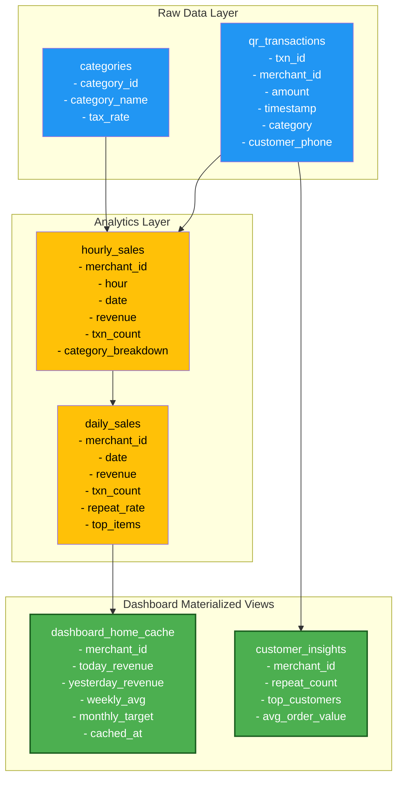

### Schema Definition

```sql
-- Raw transaction data
CREATE TABLE qr_transactions (
    txn_id VARCHAR(50) PRIMARY KEY,
    merchant_id VARCHAR(50) NOT NULL,
    amount BIGINT NOT NULL,  -- in VND
    timestamp TIMESTAMP NOT NULL,
    category_id VARCHAR(50),
    customer_phone VARCHAR(20),
    payment_method VARCHAR(20),
    status VARCHAR(20),  -- 'completed', 'pending', 'failed'
    created_at TIMESTAMP DEFAULT CURRENT_TIMESTAMP,
    INDEX idx_merchant_timestamp (merchant_id, timestamp),
    INDEX idx_customer_phone (customer_phone)
);

-- Hourly aggregation (materialized view)
CREATE TABLE hourly_sales (
    merchant_id VARCHAR(50),
    date_hour TIMESTAMP NOT NULL,
    revenue BIGINT,
    transaction_count INT,
    category_breakdown JSON,  -- {"category_id": revenue}
    repeat_customer_count INT,
    created_at TIMESTAMP DEFAULT CURRENT_TIMESTAMP,
    PRIMARY KEY (merchant_id, date_hour)
);

-- Daily dashboard cache
CREATE TABLE dashboard_daily_cache (
    merchant_id VARCHAR(50) PRIMARY KEY,
    date DATE NOT NULL,
    today_revenue BIGINT,
    yesterday_revenue BIGINT,
    week_avg_revenue BIGINT,
    monthly_target BIGINT,
    repeat_rate DECIMAL(5,2),  -- 0-100 %
    top_items JSON,  -- [{item: name, revenue: 1000000}]
    top_customers JSON,  -- [{phone: "0899xxx", spend: 500000}]
    cached_at TIMESTAMP,
    updated_at TIMESTAMP DEFAULT CURRENT_TIMESTAMP
);
```

### UI-to-DB Mapping

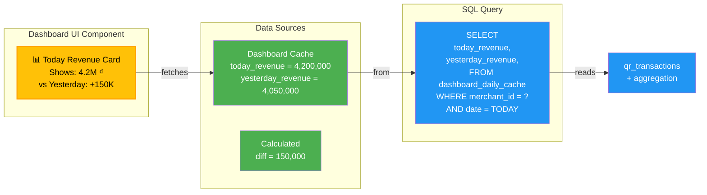

---

## 4.2 Customer Engagement Platform - Data Schema

### Database Design

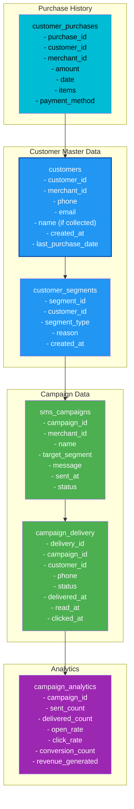

### Schema SQL

```sql
-- Customer master table
CREATE TABLE customers (
    customer_id VARCHAR(50) PRIMARY KEY,
    merchant_id VARCHAR(50) NOT NULL,
    phone VARCHAR(20) NOT NULL,
    email VARCHAR(100),
    customer_name VARCHAR(100),
    created_at TIMESTAMP,
    last_purchase_date DATE,
    total_purchases INT DEFAULT 0,
    total_spend BIGINT DEFAULT 0,
    frequency_score INT,  -- 0-100, how often they buy
    INDEX idx_merchant_phone (merchant_id, phone),
    INDEX idx_last_purchase (merchant_id, last_purchase_date)
);

-- Customer segments (e.g., "frequent_buyer", "at_risk", "vip")
CREATE TABLE customer_segments (
    segment_id VARCHAR(50) PRIMARY KEY,
    customer_id VARCHAR(50) NOT NULL,
    merchant_id VARCHAR(50),
    segment_type VARCHAR(50),  -- 'frequent', 'at_risk', 'vip', 'new'
    calculated_date DATE,
    FOREIGN KEY (customer_id) REFERENCES customers(customer_id)
);

-- SMS campaign table
CREATE TABLE sms_campaigns (
    campaign_id VARCHAR(50) PRIMARY KEY,
    merchant_id VARCHAR(50) NOT NULL,
    campaign_name VARCHAR(200),
    message_template TEXT,
    target_segment VARCHAR(50),
    sent_at TIMESTAMP,
    scheduled_for TIMESTAMP,
    status VARCHAR(20),  -- 'draft', 'scheduled', 'sent', 'completed'
    created_at TIMESTAMP,
    updated_at TIMESTAMP,
    INDEX idx_merchant_status (merchant_id, status)
);

-- Campaign delivery log
CREATE TABLE campaign_delivery (
    delivery_id VARCHAR(50) PRIMARY KEY,
    campaign_id VARCHAR(50) NOT NULL,
    customer_id VARCHAR(50) NOT NULL,
    phone_number VARCHAR(20),
    message_text TEXT,
    status VARCHAR(20),  -- 'pending', 'sent', 'delivered', 'failed'
    sent_at TIMESTAMP,
    delivered_at TIMESTAMP,
    read_at TIMESTAMP,
    clicked_at TIMESTAMP,
    click_url VARCHAR(500),
    INDEX idx_campaign_customer (campaign_id, customer_id),
    FOREIGN KEY (campaign_id) REFERENCES sms_campaigns(campaign_id)
);

-- Campaign metrics (aggregated for fast analytics)
CREATE TABLE campaign_metrics (
    campaign_id VARCHAR(50) PRIMARY KEY,
    sent_count INT,
    delivered_count INT,
    failed_count INT,
    open_rate DECIMAL(5,2),  -- 0-100 %
    click_rate DECIMAL(5,2),
    conversion_count INT,
    revenue_generated BIGINT,
    cost_per_sms INT,  -- 500 VND typically
    roi_percent DECIMAL(6,2),
    updated_at TIMESTAMP
);
```

### UI Component to DB Mapping

```
┌─ SMS Campaign Builder UI ──────────┐
│ Target: [Frequent Buyers]          │
│ -> SELECT customers FROM customer_segments
│    WHERE segment_type = 'frequent'
│    AND merchant_id = '12345'
│    -> Returns: 250 customers
│
│ Message: "Hi {name}, come back..."
│ -> INSERT INTO sms_campaigns (...)
│    INSERT INTO campaign_delivery (...)
│    -> campaign_id = 'camp_001'
│
│ Cost: 250 SMS x 500₫ = 125K₫
│ -> Calculate from: SELECT COUNT(*) * 500
│    FROM customers WHERE segment_type = 'frequent'
└────────────────────────────────────┘

┌─ Campaign Analytics UI ────────────┐
│ Shows:                              │
│ - Sent: 250                         │
│ - Delivered: 248 (99.2%)            │
│ - Open: 78 (31.4%)                  │
│ - Click: 32 (12.9%)                 │
│ - ROI: 188%                         │
│ -> SELECT sent_count, delivered_count,
│           open_rate, click_rate, roi_percent
│    FROM campaign_metrics
│    WHERE campaign_id = 'camp_001'
└────────────────────────────────────┘
```

---

## 4.3 E-Invoice & Compliance - Data Schema

### Database Design

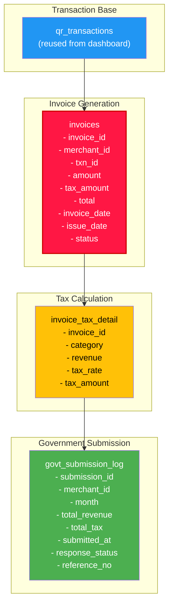

### Schema SQL

```sql
-- Invoice table
CREATE TABLE invoices (
    invoice_id VARCHAR(50) PRIMARY KEY,
    merchant_id VARCHAR(50) NOT NULL,
    txn_id VARCHAR(50) NOT NULL,
    invoice_number VARCHAR(20),  -- MOM-2025-07-0001
    invoice_date DATE NOT NULL,
    issue_date TIMESTAMP DEFAULT CURRENT_TIMESTAMP,
    total_amount BIGINT NOT NULL,  -- in VND
    tax_amount BIGINT,
    tax_rate DECIMAL(5,2),
    total_with_tax BIGINT,
    customer_phone VARCHAR(20),
    customer_name VARCHAR(100),
    status VARCHAR(20),  -- 'draft', 'issued', 'submitted', 'acknowledged'
    submitted_to_govt TIMESTAMP,
    govt_reference_no VARCHAR(50),
    created_at TIMESTAMP DEFAULT CURRENT_TIMESTAMP,
    INDEX idx_merchant_month (merchant_id, invoice_date)
);

-- Tax detail per invoice
CREATE TABLE invoice_tax_details (
    detail_id VARCHAR(50) PRIMARY KEY,
    invoice_id VARCHAR(50) NOT NULL,
    category_id VARCHAR(50),
    revenue BIGINT,
    tax_rate DECIMAL(5,2),  -- e.g., 10.0 for 10%
    tax_amount BIGINT,
    FOREIGN KEY (invoice_id) REFERENCES invoices(invoice_id)
);

-- Monthly tax summary for filing
CREATE TABLE tax_monthly_summary (
    summary_id VARCHAR(50) PRIMARY KEY,
    merchant_id VARCHAR(50) NOT NULL,
    year INT,
    month INT,
    total_revenue BIGINT,
    total_tax BIGINT,
    invoice_count INT,
    status VARCHAR(20),  -- 'calculated', 'filed', 'acknowledged'
    filed_at TIMESTAMP,
    govt_response TIMESTAMP,
    filing_reference_no VARCHAR(50),
    created_at TIMESTAMP,
    updated_at TIMESTAMP,
    UNIQUE KEY (merchant_id, year, month)
);

-- Government submission log
CREATE TABLE govt_submission_log (
    submission_id VARCHAR(50) PRIMARY KEY,
    merchant_id VARCHAR(50) NOT NULL,
    month INT,
    year INT,
    total_invoices INT,
    total_revenue BIGINT,
    total_tax BIGINT,
    submitted_at TIMESTAMP,
    response_status VARCHAR(20),  -- 'pending', 'accepted', 'rejected'
    response_message TEXT,
    govt_reference_no VARCHAR(100),
    created_at TIMESTAMP
);
```

### Sample Data Mapping: Invoice Generation

```sql
-- When merchant receives QR payment
INSERT INTO qr_transactions VALUES (
    'txn_12345',
    'merchant_789',
    100000,  -- 100K VND
    '2025-07-10 14:23:45',
    'category_food',
    '0899123456',
    'qr_dynamic',
    'completed'
);

-- Auto-generate invoice (backend process < 5 sec)
INSERT INTO invoices VALUES (
    'inv_001',
    'merchant_789',
    'txn_12345',
    'MOM-2025-07-0001',
    '2025-07-10',
    CURRENT_TIMESTAMP,
    100000,
    10000,  -- 10% tax
    10.0,
    110000,
    '0899123456',
    'Nguyễn Văn A',  -- if captured
    'issued',
    CURRENT_TIMESTAMP,
    'MOMO-EVT-2025-07-0001'
);

-- Insert tax detail
INSERT INTO invoice_tax_details VALUES (
    'tax_001',
    'inv_001',
    'category_food',
    100000,
    10.0,
    10000
);

-- Update monthly summary
UPDATE tax_monthly_summary SET
    total_revenue = total_revenue + 100000,
    total_tax = total_tax + 10000,
    invoice_count = invoice_count + 1,
    updated_at = CURRENT_TIMESTAMP
WHERE merchant_id = 'merchant_789'
  AND year = 2025
  AND month = 7;
```

---

## 4.4 Complete User Journey Data Flow

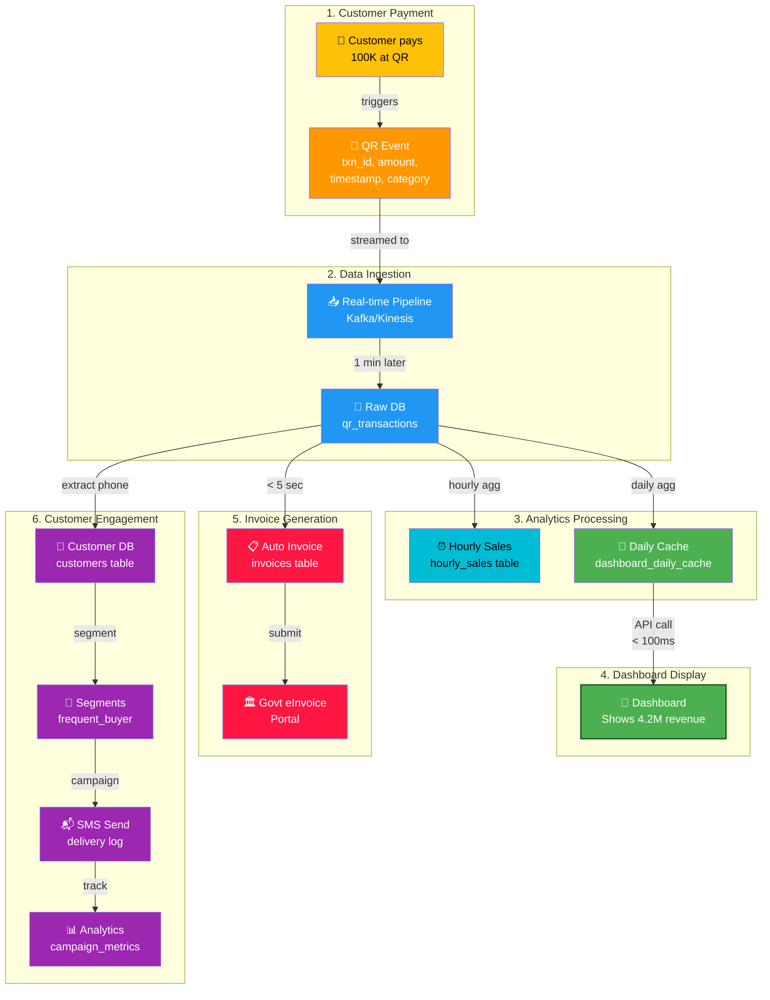

---

## 4.5 API Contracts (Product Team View)

### Dashboard API

```json
{
  "endpoint": "GET /v1/merchant/dashboard/home",
  "description": "Get today's dashboard summary",
  "request": {
    "merchant_id": "string (required)",
    "date": "YYYY-MM-DD (optional, default today)"
  },
  "response": {
    "today_revenue": 4200000,
    "yesterday_revenue": 4050000,
    "weekly_avg": 4100000,
    "monthly_target": 5000000,
    "target_progress_percent": 84,
    "repeat_rate": 35,
    "top_items": [
      {"name": "Bún phở", "revenue": 1800000, "percent": 43},
      {"name": "Egg roll", "revenue": 900000, "percent": 21}
    ],
    "top_customers": [
      {"phone": "0899123456", "name": "Nguyễn A", "purchases": 45, "total_spend": 2300000}
    ],
    "cached_at": "2025-07-14T14:00:00Z"
  }
}
```

### SMS Campaign API

```json
{
  "endpoint": "POST /v1/merchant/campaigns/sms/send",
  "description": "Send SMS campaign to customer segment",
  "request": {
    "merchant_id": "string",
    "campaign_name": "Comeback20 Sale",
    "segment_type": "frequent_buyers",
    "message_template": "Hi {name}, come back for 20% off!",
    "scheduled_for": "2025-07-14T14:00:00Z"
  },
  "response": {
    "campaign_id": "camp_12345",
    "target_count": 250,
    "status": "scheduled",
    "cost_vnd": 125000,
    "scheduled_at": "2025-07-14T14:00:00Z"
  }
}
```

### Invoice Generation API

```json
{
  "endpoint": "POST /v1/merchant/invoices/generate",
  "description": "Auto-generate invoice from QR transaction (internal)",
  "request": {
    "txn_id": "txn_12345",
    "merchant_id": "merchant_789",
    "amount": 100000
  },
  "response": {
    "invoice_id": "inv_001",
    "invoice_number": "MOM-2025-07-0001",
    "status": "issued",
    "submitted_to_govt": true,
    "govt_reference": "MOMO-EVT-2025-07-0001"
  }
}
```

---

## 4.6 Figma Component Library Map

```mermaid
graph TB
    subgraph "Dashboard Components"
        C1["KPI Card<br/>Revenue/Target<br/>Comparison metric"]
        C2["Line Chart<br/>7-day trend<br/>Interactive"]
        C3["Category Grid<br/>Item breakdown<br/>Top performers"]
        C4["Customer List<br/>Top buyers<br/>Phone/spend"]
    end

    subgraph "Campaign Components"
        C5["Segment Selector<br/>Dropdown<br/>Count display"]
        C6["Message Editor<br/>Text input<br/>Char counter"]
        C7["Schedule Picker<br/>Date + Time<br/>TZ aware"]
        C8["Cost Calculator<br/>Real-time<br/>ROI projection"]
    end

    subgraph "Invoice Components"
        C9["Invoice Card<br/>Display<br/>Status badge"]
        C10["Tax Summary<br/>Breakdown<br/>Calculation"]
        C11["Filing Wizard<br/>Step indicator<br/>Form fields"]
    end

    subgraph "Shared Components"
        SHARED["Modal, Button,<br/>Input, Dropdown,<br/>Table, Toast"]
    end

    C1 --> SHARED
    C2 --> SHARED
    C3 --> SHARED
    C4 --> SHARED
    C5 --> SHARED
    C6 --> SHARED
    C7 --> SHARED
    C8 --> SHARED
    C9 --> SHARED
    C10 --> SHARED
    C11 --> SHARED

    style C1 fill:#2196F3,color:#fff
    style C2 fill:#2196F3,color:#fff
    style C3 fill:#2196F3,color:#fff
    style C4 fill:#2196F3,color:#fff
    style C5 fill:#4CAF50,color:#fff
    style C6 fill:#4CAF50,color:#fff
    style C7 fill:#4CAF50,color:#fff
    style C8 fill:#4CAF50,color:#fff
    style C9 fill:#FF1744,color:#fff
    style C10 fill:#FF1744,color:#fff
    style C11 fill:#FF1744,color:#fff
    style SHARED fill:#9C27B0,color:#fff,stroke:#6A1B9A,stroke-width:2px
```

---

# APPENDIX: Implementation Roadmap

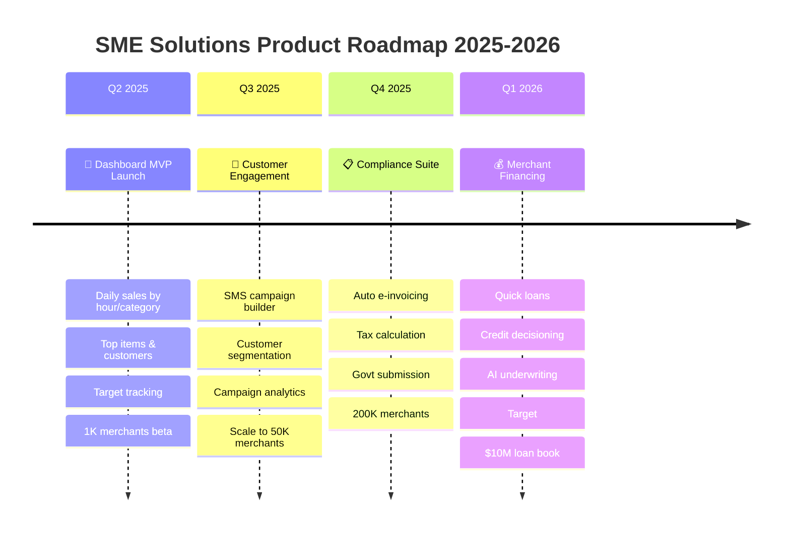

---

**Document Version**: 1.0  
**Last Updated**: July 14, 2026  
**Owner**: Product Manager - SME Merchants  
**Status**: Ready for Engineering Kickoff

