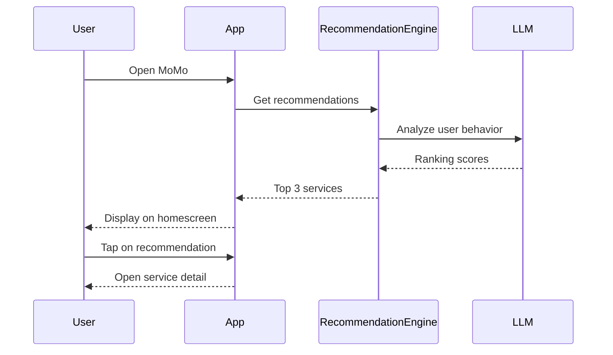
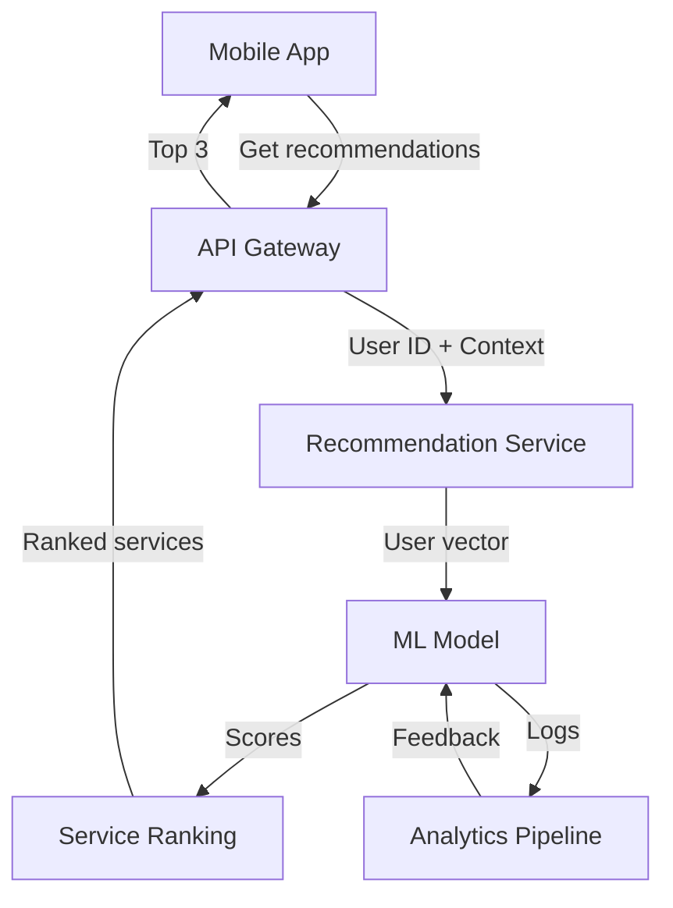
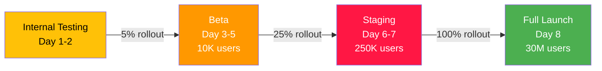

# Feature Specification Template

> **Purpose**: Define detailed specifications for a product feature. Use this when you have high confidence in what needs to be built and are ready to brief engineering.

---

## 1. Feature Overview

**Feature Name**: [e.g., "AutoXsell LLM Recommendations"]
**Product Area**: [e.g., "Growth & Discovery"]
**Sprint**: [e.g., "Q2 2025, Sprint 1"]
**Priority**: [P0/P1/P2/P3]
**Owner**: [Product Manager]

---

## 2. Background & Context

### 2.1 Why This Feature?
[Problem it solves]
- Impact: [Business impact]
- Urgency: [Why now?]

### 2.2 Success Metrics
- Primary: [Metric 1] from [X] to [Y]
- Secondary: [Metric 2] from [X] to [Y]

---

## 3. User Story

**As a** [user type]
**I want to** [action]
**So that** [benefit]

### Example
- As a **MoMo user**, I want to **see AI-recommended financial services on my homescreen**, so that **I can discover relevant products without searching**.

---

## 4. Acceptance Criteria

### Functional Requirements

- [ ] When user opens homescreen, AI recommends top 3 services based on behavior
- [ ] Recommendation refresh happens every [X] hours
- [ ] Services are ranked by ML confidence score
- [ ] User can mark "Not interested" to personalize
- [ ] Recommendations are shown in [position] on screen

### Non-Functional Requirements

- [ ] Recommendation latency: < [X]ms
- [ ] Availability: 99.95%+
- [ ] Data freshness: < [X] hours old
- [ ] Personalization accuracy: > [X]%
- [ ] Mobile performance: < [X]MB memory

---

## 5. User Interaction Flow

### 5.1 Happy Path



### 5.2 Edge Cases

**Case 1**: New user with no behavior data
- Action: Show default popular services
- Confidence: Low (show randomized)

**Case 2**: Recommendation fails to load
- Action: Show cached previous recommendations
- Fallback: Show hardcoded popular services

**Case 3**: User marks "Not interested" on service
- Action: Update user preference model
- Result: Deprioritize similar services

---

## 6. Wireframes & Mockups

### Visual Layout

```
┌─────────────────────────┐
│     MoMo Homescreen     │
├─────────────────────────┤
│  [Banner Ad]            │
├─────────────────────────┤
│ AI Recommended For You: │
│                         │
│ ┌────┐ ┌────┐ ┌────┐   │
│ │💰  │ │📈  │ │💳  │   │
│ │Loan│ │Inv │ │Ins │   │
│ └────┘ └────┘ └────┘   │
│                         │
├─────────────────────────┤
│ More Services...        │
└─────────────────────────┘
```

[Link to design mockup in Figma]

---

## 7. Technical Specification

### 7.1 Architecture



### 7.2 Data Schema

```json
{
  "recommendation_request": {
    "user_id": "string",
    "timestamp": "ISO 8601",
    "context": {
      "device_type": "string",
      "app_version": "string",
      "user_segment": "string"
    }
  },
  "recommendation_response": {
    "recommendations": [
      {
        "service_id": "string",
        "service_name": "string",
        "confidence_score": 0.95,
        "reason": "string",
        "icon_url": "string",
        "cta_text": "string"
      }
    ],
    "generated_at": "ISO 8601"
  }
}
```

### 7.3 API Endpoint

**Endpoint**: `POST /v1/recommendations/homescreen`

**Request**:
```bash
curl -X POST https://api.momo.vn/v1/recommendations/homescreen \
  -H "Content-Type: application/json" \
  -H "Authorization: Bearer {token}" \
  -d '{
    "user_id": "user_123",
    "limit": 3,
    "context": {"device": "mobile"}
  }'
```

**Response**:
```json
{
  "status": "success",
  "data": {
    "recommendations": [...]
  },
  "latency_ms": 145
}
```

### 7.4 Database Changes

**New Table**: `user_recommendations`
```sql
CREATE TABLE user_recommendations (
  id UUID PRIMARY KEY,
  user_id VARCHAR(255),
  recommendation_id VARCHAR(255),
  service_id VARCHAR(255),
  confidence_score FLOAT,
  generated_at TIMESTAMP,
  viewed_at TIMESTAMP,
  clicked_at TIMESTAMP,
  INDEX idx_user_generated (user_id, generated_at)
);
```

---

## 8. Dependencies & Integrations

### Dependencies
- [ ] User profile service (behavior data)
- [ ] ML recommendation model (inference)
- [ ] Service catalog (service details)
- [ ] Analytics pipeline (feedback loop)

### Third-party Integrations
- [ ] Mixpanel (event tracking)
- [ ] Segment (data warehouse)

---

## 9. Testing Strategy

### 9.1 Unit Tests
- Test recommendation ranking algorithm
- Test LLM prompt formatting
- Test error handling

### 9.2 Integration Tests
- Test API request/response
- Test database persistence
- Test ML model inference

### 9.3 E2E Tests
- User opens app → sees recommendations
- User clicks recommendation → navigates to service
- System logs event → updates ML model

### 9.4 Performance Tests
- Load test: 1000 concurrent users
- Latency test: P99 < 200ms
- Memory test: < 100MB app size increase

### 9.5 UAT Checklist
- [ ] Recommendations appear on homescreen
- [ ] Refreshes correctly every X hours
- [ ] "Not interested" works as expected
- [ ] Fallback shows when service unavailable
- [ ] Works on iOS and Android
- [ ] Works with different app versions

---

## 10. Success Criteria & Launch Readiness

### Launch Criteria
- [ ] All acceptance criteria met
- [ ] E2E tests passing
- [ ] Performance benchmarks hit
- [ ] UAT sign-off from PO
- [ ] Documentation complete
- [ ] Analytics instrumentation ready

### Rollout Strategy



### Monitoring Post-Launch
- [ ] CTR within expected range
- [ ] No spike in error rates
- [ ] Latency within SLA
- [ ] User feedback positive (NPS > 40)

---

## 11. Documentation

### For Engineers
- API spec: [Link]
- Database schema: [Link]
- ML model details: [Link]
- Deployment checklist: [Link]

### For Designers
- Component spec: [Link]
- Interaction guidelines: [Link]
- Accessibility notes: [Link]

### For QA
- Test cases: [Link]
- Regression test plan: [Link]
- Performance baselines: [Link]

---

## 12. Risk Assessment

| Risk | Impact | Probability | Mitigation |
|------|--------|-------------|-----------|
| ML model quality low | High | Medium | A/B test before launch |
| High latency | High | Low | Cache recommendations |
| User confusion | Medium | Medium | Onboarding tooltip |

---

## 13. Questions & Decisions

### Open Questions
- [ ] Should we personalize based on friends' behavior?
- [ ] How often should recommendations refresh?
- [ ] Should we A/B test different ranking algorithms?

### Decisions Made
- [x] Use LLM for personalization
- [x] Show top 3 recommendations
- [x] Refresh every 6 hours

---

## 14. Sign-offs

- [ ] **Product Manager**: Approved by [Name] on [Date]
- [ ] **Engineering Lead**: Approved by [Name] on [Date]
- [ ] **Design Lead**: Approved by [Name] on [Date]
- [ ] **QA Lead**: Approved by [Name] on [Date]

---

**Version**: 1.0  
**Last Updated**: [Date]  
**Approved**: [Date]  
**Sprint**: [Sprint number]
