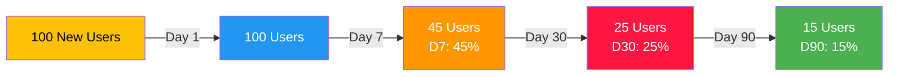
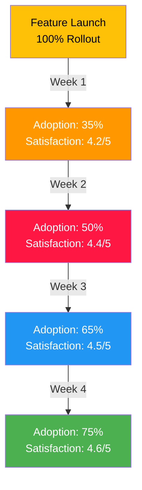
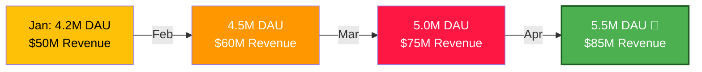

# Metrics & KPI Tracking Template

> **Purpose**: Define, track, and monitor key metrics for your product area. Use this to measure progress against goals and inform decision-making.

---

## Product Area Overview

**Product**: [Product name]
**Owner**: [Product Manager]
**Period**: [Q1 2025]
**Last Updated**: [Date]

---

## 1. Strategic Goals (OKRs)

### Objective 1: [High-level goal]
- Key Result 1.1: [Measurable outcome] - Target: [X]
- Key Result 1.2: [Measurable outcome] - Target: [X]

### Objective 2: [High-level goal]
- Key Result 2.1: [Measurable outcome] - Target: [X]
- Key Result 2.2: [Measurable outcome] - Target: [X]

### Objective 3: [High-level goal]
- Key Result 3.1: [Measurable outcome] - Target: [X]
- Key Result 3.2: [Measurable outcome] - Target: [X]

---

## 2. Primary Metrics (North Star)

These are the top-level metrics that define product success.

| Metric | Current | Q1 Target | Q2 Target | Q3 Target | Q4 Target | Trend |
|--------|---------|-----------|-----------|-----------|-----------|-------|
| [Metric Name] | [Current] | [Target] | [Target] | [Target] | [Target] | 📈/📉 |
| [Metric Name] | [Current] | [Target] | [Target] | [Target] | [Target] | 📈/📉 |
| [Metric Name] | [Current] | [Target] | [Target] | [Target] | [Target] | 📈/📉 |

---

## 3. Acquisition Metrics

Metrics that measure how we attract new users.

| Metric | Formula | Q1 2024 | Q1 2025 Target | Status |
|--------|---------|---------|--------------|--------|
| New Signups | DAU increase | 500K | 750K | 🟡 On track |
| Signup Conversion Rate | Signups / Visitors | 5% | 8% | 🔴 Behind |
| CAC (Cost per Acquisition) | Marketing Spend / Signups | $2 | $1.50 | 🟢 Ahead |
| Viral Coefficient | Referral invites sent / signups | 1.2 | 1.5 | 🟡 On track |

---

## 4. Engagement Metrics

Metrics that measure how often users interact with the product.

| Metric | Definition | Q1 2024 | Q1 2025 Target | Owner |
|--------|-----------|---------|--------------|-------|
| DAU (Daily Active Users) | Users who use product daily | 4.2M | 5.5M | [Name] |
| MAU (Monthly Active Users) | Unique users in 30 days | 15M | 20M | [Name] |
| Sessions per User | Avg sessions per DAU per week | 3.5 | 4.2 | [Name] |
| Session Duration | Avg time per session | 12 min | 15 min | [Name] |
| Feature Adoption | % of users using new feature | 35% | 60% | [Name] |

---

## 5. Retention Metrics

Metrics that measure how many users stay engaged over time.

| Cohort | D1 | D7 | D30 | D90 | D180 | Trend |
|--------|----|----|-----|-----|------|-------|
| Jan 2024 | 100% | 48% | 28% | 18% | 10% | 📉 |
| Feb 2024 | 100% | 50% | 32% | 22% | 12% | 📈 |
| Mar 2024 | 100% | 52% | 35% | 25% | 14% | 📈 |
| Target | 100% | 55% | 40% | 30% | 18% | 🎯 |

---

## 6. Monetization Metrics

Metrics that measure revenue and unit economics.

| Metric | Formula | Q1 2024 | Q1 2025 | YoY Change |
|--------|---------|---------|---------|-----------|
| **Revenue** | Total $ collected | $50M | $75M | +50% |
| ARPU | Revenue / MAU | $3.33 | $3.75 | +12.5% |
| Paying User % | Users who paid / MAU | 40% | 50% | +10pp |
| Transaction Count | Total txns | 100M | 150M | +50% |
| Avg Transaction Value | Revenue / Txns | $0.50 | $0.50 | - |
| LTV (Lifetime Value) | Revenue per user lifetime | $200 | $300 | +50% |

---

## 7. Quality & Performance Metrics

Metrics that measure technical health and reliability.

| Metric | Target | Current | Status |
|--------|--------|---------|--------|
| Uptime | 99.95% | 99.94% | 🟡 |
| P95 Latency | < 200ms | 180ms | 🟢 |
| Error Rate | < 0.1% | 0.05% | 🟢 |
| Crash Rate | < 0.5% | 0.2% | 🟢 |
| App Size | < 150MB | 145MB | 🟢 |
| Security Score | A+ | A | 🟡 |

---

## 8. User Satisfaction Metrics

Metrics that measure user happiness and product-market fit.

| Metric | Definition | Q1 2024 | Q1 2025 | Target |
|--------|-----------|---------|---------|--------|
| NPS (Net Promoter Score) | Likelihood to recommend (0-100) | 42 | 45 | 50 |
| CSAT (Customer Satisfaction) | Overall satisfaction (1-5) | 4.3 | 4.4 | 4.6 |
| App Rating | App store rating (1-5) | 4.5 | 4.6 | 4.7 |
| Churn Rate | % of users who leave monthly | 12% | 11% | 10% |

---

## 9. Feature-Specific Metrics

Track key metrics for major features.

### Feature: [Feature Name]

| Time | Metric | Value | Change |
|------|--------|-------|--------|
| Week 1 | Adoption | 35% | +35% |
| Week 1 | Satisfaction | 4.2/5 | Baseline |
| Week 2 | Adoption | 50% | +15% |
| Week 2 | Satisfaction | 4.4/5 | +0.2 |

---

## 10. A/B Test Results

Track ongoing experiments and learnings.

| Test | Variant | Metric | Control | Test | Winner | Impact |
|------|---------|--------|---------|------|--------|--------|
| [Name] | [Desc] | CTR | 5.2% | 6.1% | Test | +17% |
| [Name] | [Desc] | Conv. | 2.1% | 2.0% | Control | -5% |

---

## 11. Competitive Benchmarking

Compare your metrics to industry standards and competitors.

| Metric | MoMo | Competitor A | Competitor B | Industry Avg |
|--------|------|-------------|-------------|-------------|
| D30 Retention | 35% | 32% | 28% | 30% |
| ARPU | $3.75 | $3.20 | $2.50 | $3.00 |
| NPS | 45 | 42 | 38 | 40 |
| Session Duration | 15 min | 12 min | 10 min | 11 min |

---

## 12. Dashboard & Visualization

### Monthly Trend

---

## 13. Alerts & Thresholds

Set up alerts to catch metric anomalies.

| Metric | Green | Yellow | Red | Action |
|--------|-------|--------|-----|--------|
| DAU Growth | +5% MoM | 0-5% MoM | -5% MoM | War room meeting |
| Churn Rate | < 10% | 10-15% | > 15% | Product review |
| Crash Rate | < 0.2% | 0.2-0.5% | > 0.5% | Hotfix deployment |

---

## 14. Data Sources & Methodology

- **Analytics Platform**: [Mixpanel/Amplitude/etc]
- **CRM**: [Segment/Salesforce/etc]
- **Financial**: [Accounting system]
- **Surveys**: [Qualtrics/SurveySparrow]
- **Calculation Frequency**: Daily/Weekly/Monthly

### Data Quality
- Last validation: [Date]
- Known issues: [Any gaps]
- Latency: [How delayed is data]

---

## 15. Monthly Review Checklist

- [ ] Review all metrics against targets
- [ ] Identify trends and anomalies
- [ ] Update forecasts
- [ ] Share with stakeholders
- [ ] Adjust strategy if needed
- [ ] Set focus areas for next month

---

**Version**: 1.0  
**Last Updated**: [Date]  
**Review Frequency**: Monthly  
**Next Review**: [Date]
