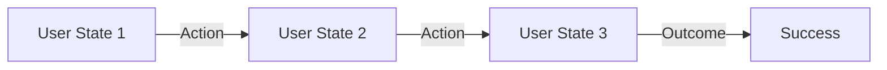
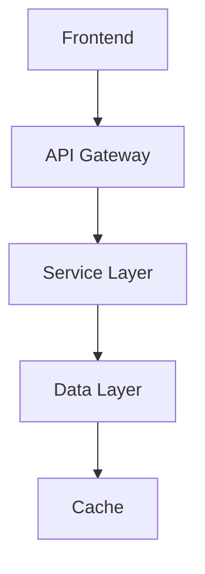
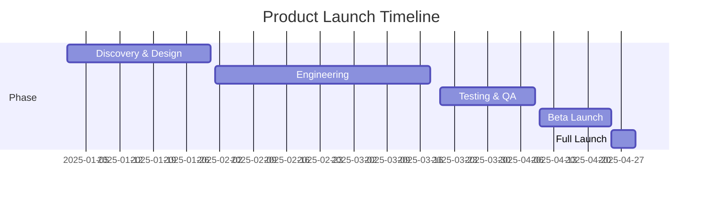

# Product Requirements Document (PRD) Template

> **Purpose**: Define product requirements for a new feature, product, or initiative. Use this template to structure your thinking and communicate clearly across teams.

---

## 1. Executive Summary

**Product Name**: [e.g., "AutoXsell LLM-Powered Recommendations"]
**Owner**: [Product Manager/Lead]
**Timeline**: [Launch date]
**Priority**: [P0/P1/P2]
**Expected Impact**: [Business metrics expected to improve]

---

## 2. Problem Statement

### 2.1 Current State
- What is the current situation?
- What problems exist?
- Who is affected?

### 2.2 User Pain Points
- Pain Point 1: [What users are struggling with]
- Pain Point 2: [What users are struggling with]
- Pain Point 3: [What users are struggling with]

### 2.3 Business Impact
- What is the current cost of not solving this?
- What revenue/efficiency is being lost?

---

## 3. Solution Overview

### 3.1 Product Vision
[One paragraph vision of what this product will achieve]

### 3.2 User Journey

### 3.3 Key Features

| Feature | Description | Priority | Complexity |
|---------|-------------|----------|-----------|
| Feature 1 | What it does | P0/P1/P2 | L/M/H |
| Feature 2 | What it does | P0/P1/P2 | L/M/H |
| Feature 3 | What it does | P0/P1/P2 | L/M/H |

---

## 4. Target Users

### 4.1 User Segments
- **Segment 1**: [Demographics, behaviors, needs]
- **Segment 2**: [Demographics, behaviors, needs]
- **Segment 3**: [Demographics, behaviors, needs]

### 4.2 Use Cases
- **Use Case 1**: User wants to [action] so they can [outcome]
- **Use Case 2**: User wants to [action] so they can [outcome]

### 4.3 Success Criteria
- User A should be able to [task] in < [time]
- Success rate for [task] should be > [%]
- User satisfaction should be > [NPS/Rating]

---

## 5. Technical Approach

### 5.1 Architecture

### 5.2 Technology Stack
- **Frontend**: [Framework/Library]
- **Backend**: [Language/Framework]
- **Database**: [Database type]
- **Infrastructure**: [Cloud/On-prem]

### 5.3 Dependencies
- Dependency 1: [What this depends on]
- Dependency 2: [What this depends on]

---

## 6. Metrics & KPIs

### 6.1 Success Metrics

| Metric | Baseline | Target | Timeline |
|--------|----------|--------|----------|
| Metric 1 | [Current] | [Goal] | Q1 2025 |
| Metric 2 | [Current] | [Goal] | Q1 2025 |
| Metric 3 | [Current] | [Goal] | Q2 2025 |

### 6.2 Health Metrics
- System uptime: > 99.9%
- P99 latency: < [ms]
- Error rate: < [%]

### 6.3 Business Metrics
- Revenue impact: +[%]
- User satisfaction: [NPS/Rating]
- Cost per unit: $[X]

---

## 7. Timeline & Milestones

**Key Dates**:
- [Date]: Design kickoff
- [Date]: Engineering starts
- [Date]: Beta launch
- [Date]: Full launch
- [Date]: Optimization phase

---

## 8. Risks & Mitigation

| Risk | Impact | Probability | Mitigation |
|------|--------|-------------|-----------|
| Technical risk | High | Medium | [Mitigation plan] |
| User adoption risk | High | Low | [Mitigation plan] |
| Competitive risk | Medium | High | [Mitigation plan] |

---

## 9. Competition & Differentiation

### 9.1 Market Analysis
- How does this compare to competitors?
- What's unique about our approach?

### 9.2 Competitive Advantage
- Advantage 1: [Why we're better]
- Advantage 2: [Why we're better]

---

## 10. Go-to-Market Strategy

### 10.1 Launch Plan
- **Target Audience**: [Who first]
- **Launch Channel**: [Where we launch]
- **Marketing Message**: [Key differentiator]

### 10.2 Rollout Strategy
- Phase 1: [% of users, duration]
- Phase 2: [% of users, duration]
- Phase 3: [% of users, duration]

### 10.3 Success Definition
- Launch metrics: [What success looks like]
- Post-launch: [What we monitor]

---

## 11. Budget & Resources

### 11.1 Team
- **Product Manager**: [Name]
- **Engineering Lead**: [Name]
- **Design Lead**: [Name]
- **Headcount**: [Number of people]

### 11.2 Budget
- Development: $[X]K
- Infrastructure: $[X]K
- Marketing: $[X]K
- **Total**: $[X]K

---

## 12. Appendix

### 12.1 Wireframes
[Link to design mocks]

### 12.2 Data Flow
[Links to technical specs]

### 12.3 User Research
[Links to user research findings]

### 12.4 Analytics Plan
[Links to analytics tracking plan]

---

**Document Version**: 1.0  
**Last Updated**: [Date]  
**Next Review**: [Date]
